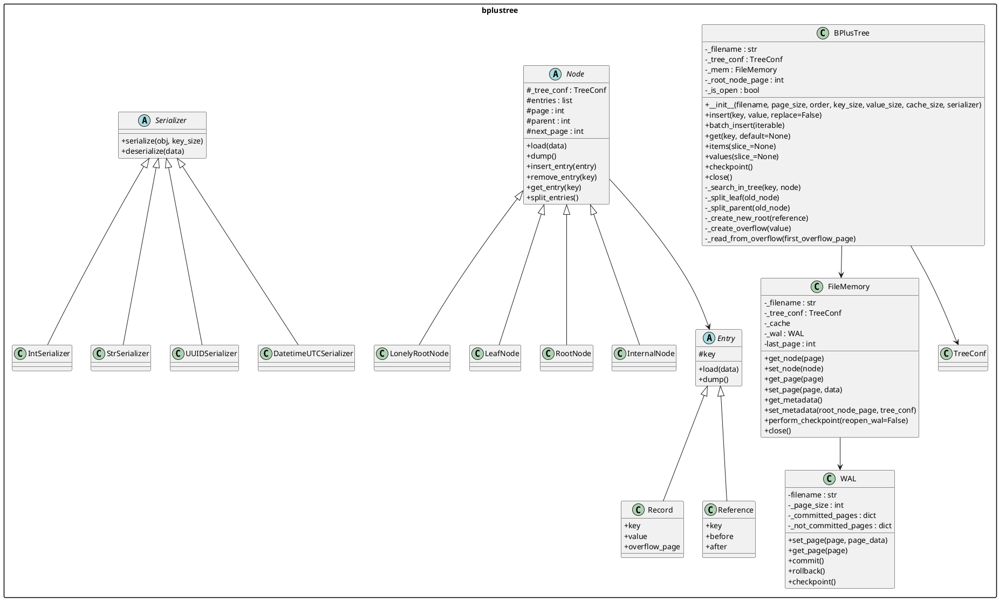

```plantuml
@startuml
skinparam classAttributeIconSize 0
skinparam packageStyle rectangle
skinparam shadowing false

package "bplustree" {
  class BPlusTree {
    -_filename : str
    -_tree_conf : TreeConf
    -_mem : FileMemory
    -_root_node_page : int
    -_is_open : bool
    +__init__(filename, page_size, order, key_size, value_size, cache_size, serializer)
    +insert(key, value, replace=False)
    +batch_insert(iterable)
    +get(key, default=None)
    +items(slice_=None)
    +values(slice_=None)
    +checkpoint()
    +close()
    -_search_in_tree(key, node)
    -_split_leaf(old_node)
    -_split_parent(old_node)
    -_create_new_root(reference)
    -_create_overflow(value)
    -_read_from_overflow(first_overflow_page)
  }

  class FileMemory {
    -_filename : str
    -_tree_conf : TreeConf
    -_cache
    -_wal : WAL
    -last_page : int
    +get_node(page)
    +set_node(node)
    +get_page(page)
    +set_page(page, data)
    +get_metadata()
    +set_metadata(root_node_page, tree_conf)
    +perform_checkpoint(reopen_wal=False)
    +close()
  }

  class WAL {
    -filename : str
    -_page_size : int
    -_committed_pages : dict
    -_not_committed_pages : dict
    +set_page(page, page_data)
    +get_page(page)
    +commit()
    +rollback()
    +checkpoint()
  }

  abstract class Node {
    #_tree_conf : TreeConf
    #entries : list
    #page : int
    #parent : int
    #next_page : int
    +load(data)
    +dump()
    +insert_entry(entry)
    +remove_entry(key)
    +get_entry(key)
    +split_entries()
  }

  class LonelyRootNode
  class LeafNode
  class RootNode
  class InternalNode

  abstract class Entry {
    #key
    +load(data)
    +dump()
  }

  class Record {
    +key
    +value
    +overflow_page
  }

  class Reference {
    +key
    +before
    +after
  }

  abstract class Serializer {
    +serialize(obj, key_size)
    +deserialize(data)
  }

  class IntSerializer
  class StrSerializer
  class UUIDSerializer
  class DatetimeUTCSerializer

  class TreeConf
}

BPlusTree --> FileMemory
FileMemory --> WAL
BPlusTree --> TreeConf
Node --> Entry
Entry <|-- Record
Entry <|-- Reference
Node <|-- LonelyRootNode
Node <|-- LeafNode
Node <|-- RootNode
Node <|-- InternalNode
Serializer <|-- IntSerializer
Serializer <|-- StrSerializer
Serializer <|-- UUIDSerializer
Serializer <|-- DatetimeUTCSerializer

@enduml
```
