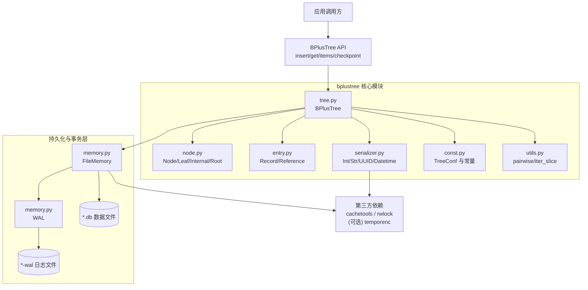

```mermaid
graph TB
    caller["应用调用方"] --> api["BPlusTree API\ninsert/get/items/checkpoint"]

    subgraph core["bplustree 核心模块"]
      tree["tree.py\nBPlusTree"]
      node["node.py\nNode/Leaf/Internal/Root"]
      entry["entry.py\nRecord/Reference"]
      serializer["serializer.py\nInt/Str/UUID/Datetime"]
      const["const.py\nTreeConf 与常量"]
      utils["utils.py\npairwise/iter_slice"]
    end

    subgraph storage["持久化与事务层"]
      memory["memory.py\nFileMemory"]
      wal["memory.py\nWAL"]
      datafile[("*.db 数据文件")]
      walfile[("*-wal 日志文件")]
    end

    deps["第三方依赖\ncachetools / rwlock\n(可选) temporenc"]

    api --> tree
    tree --> node
    tree --> entry
    tree --> serializer
    tree --> const
    tree --> utils
    tree --> memory

    memory --> wal
    memory --> datafile
    wal --> walfile

    memory --> deps
    serializer --> deps
```
