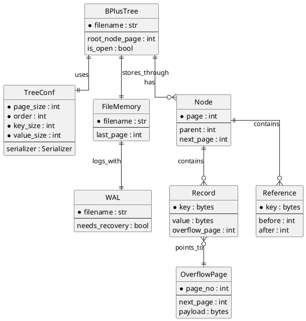

```plantuml
@startuml
skinparam linetype ortho
hide circle

entity "BPlusTree" as Tree {
  * filename : str
  --
  root_node_page : int
  is_open : bool
}

entity "TreeConf" as Conf {
  * page_size : int
  * order : int
  * key_size : int
  * value_size : int
  --
  serializer : Serializer
}

entity "FileMemory" as Mem {
  * filename : str
  --
  last_page : int
}

entity "WAL" as Wal {
  * filename : str
  --
  needs_recovery : bool
}

entity "Node" as Node {
  * page : int
  --
  parent : int
  next_page : int
}

entity "Record" as Record {
  * key : bytes
  --
  value : bytes
  overflow_page : int
}

entity "Reference" as Ref {
  * key : bytes
  --
  before : int
  after : int
}

entity "OverflowPage" as Overflow {
  * page_no : int
  --
  next_page : int
  payload : bytes
}

Tree ||--|| Conf : uses
Tree ||--|| Mem : stores_through
Mem ||--|| Wal : logs_with
Tree ||--o{ Node : has
Node ||--o{ Record : contains
Node ||--o{ Ref : contains
Record }o--|| Overflow : points_to

@enduml
```
