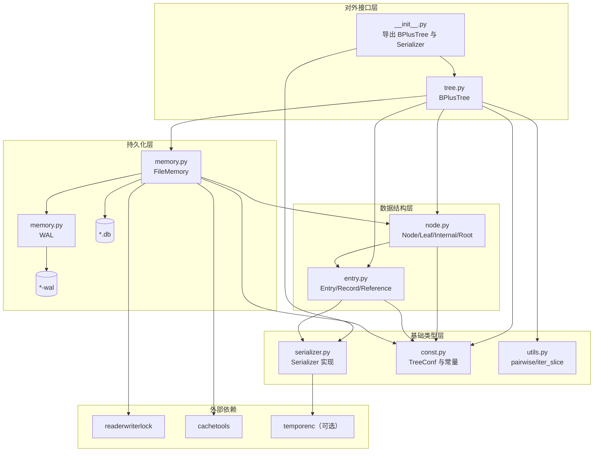

```mermaid
graph TB
    subgraph api["对外接口层"]
        init["__init__.py\n导出 BPlusTree 与 Serializer"]
        tree["tree.py\nBPlusTree"]
    end

    subgraph model["数据结构层"]
        node["node.py\nNode/Leaf/Internal/Root"]
        entry["entry.py\nEntry/Record/Reference"]
    end

    subgraph base["基础类型层"]
        serializer["serializer.py\nSerializer 实现"]
        const["const.py\nTreeConf 与常量"]
        utils["utils.py\npairwise/iter_slice"]
    end

    subgraph storage["持久化层"]
        memory["memory.py\nFileMemory"]
        wal["memory.py\nWAL"]
        db[("*.db")]
        walfile[("*-wal")]
    end

    subgraph deps["外部依赖"]
        rwlock["readerwriterlock"]
        cachetools["cachetools"]
        temporenc["temporenc（可选）"]
    end

    init --> tree
    init --> serializer

    tree --> node
    tree --> entry
    tree --> const
    tree --> utils
    tree --> memory

    node --> entry
    node --> const
    entry --> const
    entry --> serializer

    memory --> wal
    memory --> node
    memory --> const
    memory --> db
    wal --> walfile

    memory --> rwlock
    memory --> cachetools
    serializer --> temporenc
```
