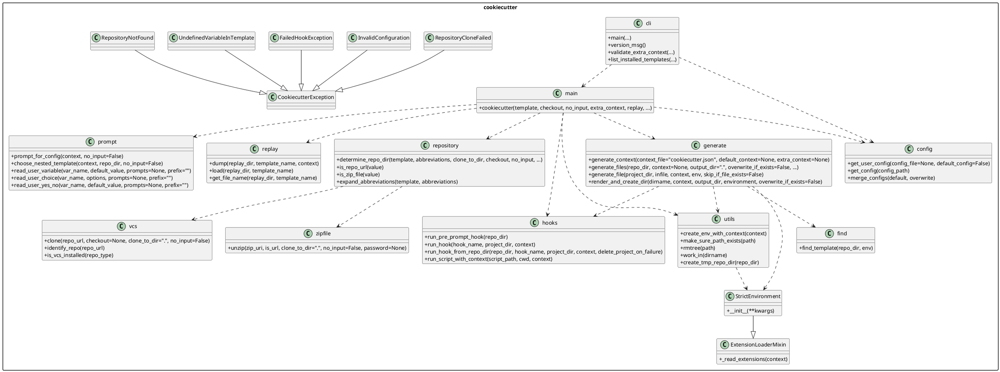

```plantuml
@startuml
skinparam classAttributeIconSize 0
skinparam packageStyle rectangle
skinparam shadowing false

package "cookiecutter" {
  class cli {
    +main(...)
    +version_msg()
    +validate_extra_context(...)
    +list_installed_templates(...)
  }

  class main {
    +cookiecutter(template, checkout, no_input, extra_context, replay, ...)
  }

  class config {
    +get_user_config(config_file=None, default_config=False)
    +get_config(config_path)
    +merge_configs(default, overwrite)
  }

  class repository {
    +determine_repo_dir(template, abbreviations, clone_to_dir, checkout, no_input, ...)
    +is_repo_url(value)
    +is_zip_file(value)
    +expand_abbreviations(template, abbreviations)
  }

  class vcs {
    +clone(repo_url, checkout=None, clone_to_dir=".", no_input=False)
    +identify_repo(repo_url)
    +is_vcs_installed(repo_type)
  }

  class zipfile {
    +unzip(zip_uri, is_url, clone_to_dir=".", no_input=False, password=None)
  }

  class generate {
    +generate_context(context_file="cookiecutter.json", default_context=None, extra_context=None)
    +generate_files(repo_dir, context=None, output_dir=".", overwrite_if_exists=False, ...)
    +generate_file(project_dir, infile, context, env, skip_if_file_exists=False)
    +render_and_create_dir(dirname, context, output_dir, environment, overwrite_if_exists=False)
  }

  class prompt {
    +prompt_for_config(context, no_input=False)
    +choose_nested_template(context, repo_dir, no_input=False)
    +read_user_variable(var_name, default_value, prompts=None, prefix="")
    +read_user_choice(var_name, options, prompts=None, prefix="")
    +read_user_yes_no(var_name, default_value, prompts=None, prefix="")
  }

  class replay {
    +dump(replay_dir, template_name, context)
    +load(replay_dir, template_name)
    +get_file_name(replay_dir, template_name)
  }

  class hooks {
    +run_pre_prompt_hook(repo_dir)
    +run_hook(hook_name, project_dir, context)
    +run_hook_from_repo_dir(repo_dir, hook_name, project_dir, context, delete_project_on_failure)
    +run_script_with_context(script_path, cwd, context)
  }

  class find {
    +find_template(repo_dir, env)
  }

  class StrictEnvironment {
    +__init__(**kwargs)
  }

  class ExtensionLoaderMixin {
    +_read_extensions(context)
  }

  class utils {
    +create_env_with_context(context)
    +make_sure_path_exists(path)
    +rmtree(path)
    +work_in(dirname)
    +create_tmp_repo_dir(repo_dir)
  }

  class CookiecutterException
  class RepositoryNotFound
  class RepositoryCloneFailed
  class InvalidConfiguration
  class FailedHookException
  class UndefinedVariableInTemplate
}

main ..> config
main ..> repository
main ..> replay
main ..> prompt
main ..> generate
main ..> hooks
main ..> utils

cli ..> main
cli ..> config

repository ..> vcs
repository ..> zipfile

generate ..> find
generate ..> hooks
generate ..> utils
generate ..> StrictEnvironment

StrictEnvironment --|> ExtensionLoaderMixin
utils ..> StrictEnvironment

RepositoryNotFound --|> CookiecutterException
RepositoryCloneFailed --|> CookiecutterException
InvalidConfiguration --|> CookiecutterException
FailedHookException --|> CookiecutterException
UndefinedVariableInTemplate --|> CookiecutterException

@enduml
```