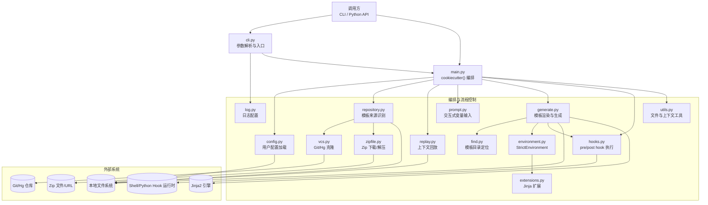

```mermaid
graph TB
    caller["调用方\nCLI / Python API"] --> cli["cli.py\n参数解析与入口"]
    caller --> mainapi["main.py\ncookiecutter() 编排"]

    subgraph orchestration["编排与流程控制"]
      config["config.py\n用户配置加载"]
      repository["repository.py\n模板来源识别"]
      vcs["vcs.py\nGit/Hg 克隆"]
      zips["zipfile.py\nZip 下载/解压"]
      replay["replay.py\n上下文回放"]
      prompt["prompt.py\n交互式变量输入"]
      generate["generate.py\n模板渲染与生成"]
      hooks["hooks.py\npre/post hook 执行"]
      find["find.py\n模板目录定位"]
      env["environment.py\nStrictEnvironment"]
      exts["extensions.py\nJinja 扩展"]
      utils["utils.py\n文件与上下文工具"]
      log["log.py\n日志配置"]
    end

    subgraph io["外部系统"]
      fs[("本地文件系统")]
      git[("Git/Hg 仓库")]
      zipsrc[("Zip 文件/URL")]
      jinja[("Jinja2 引擎")]
      hookshell[("Shell/Python Hook 运行时")]
    end

    cli --> log
    cli --> mainapi

    mainapi --> config
    mainapi --> repository
    mainapi --> replay
    mainapi --> prompt
    mainapi --> generate
    mainapi --> hooks
    mainapi --> utils

    repository --> vcs
    repository --> zips
    repository --> fs
    vcs --> git
    zips --> zipsrc

    generate --> find
    generate --> env
    env --> exts
    generate --> hooks
    generate --> fs
    generate --> jinja

    hooks --> hookshell
    replay --> fs
    config --> fs
```