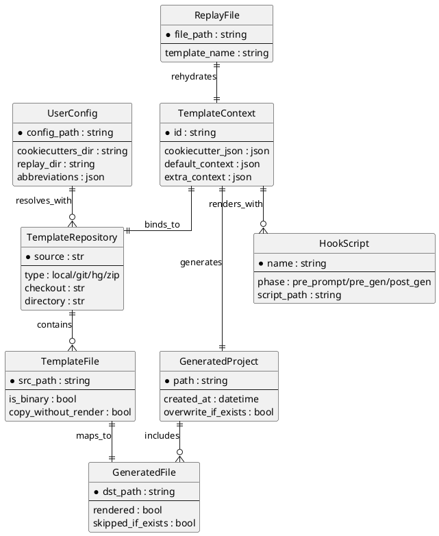

```plantuml
@startuml
skinparam linetype ortho
hide circle

entity "TemplateRepository" as Repo {
  * source : str
  --
  type : local/git/hg/zip
  checkout : str
  directory : str
}

entity "TemplateContext" as Ctx {
  * id : string
  --
  cookiecutter_json : json
  default_context : json
  extra_context : json
}

entity "GeneratedProject" as Proj {
  * path : string
  --
  created_at : datetime
  overwrite_if_exists : bool
}

entity "HookScript" as Hook {
  * name : string
  --
  phase : pre_prompt/pre_gen/post_gen
  script_path : string
}

entity "ReplayFile" as Replay {
  * file_path : string
  --
  template_name : string
}

entity "UserConfig" as UConf {
  * config_path : string
  --
  cookiecutters_dir : string
  replay_dir : string
  abbreviations : json
}

entity "TemplateFile" as TFile {
  * src_path : string
  --
  is_binary : bool
  copy_without_render : bool
}

entity "GeneratedFile" as GFile {
  * dst_path : string
  --
  rendered : bool
  skipped_if_exists : bool
}

UConf ||--o{ Repo : resolves_with
Repo ||--o{ TFile : contains
Ctx ||--|| Repo : binds_to
Ctx ||--o{ Hook : renders_with
Ctx ||--|| Proj : generates
Proj ||--o{ GFile : includes
TFile ||--|| GFile : maps_to
Replay ||--|| Ctx : rehydrates

@enduml
```