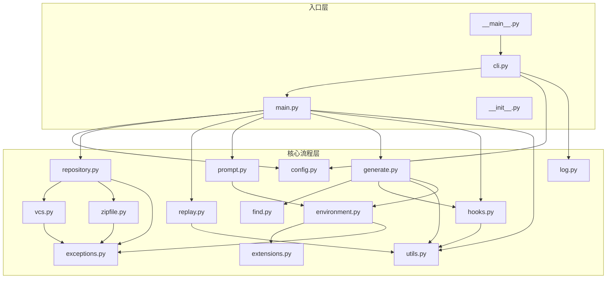

```mermaid
graph TD
    subgraph entry["入口层"]
      cli["cli.py"]
      mainapi["main.py"]
      mmain["__main__.py"]
      init["__init__.py"]
    end

    subgraph core["核心流程层"]
      generate["generate.py"]
      prompt["prompt.py"]
      hooks["hooks.py"]
      find["find.py"]
      repository["repository.py"]
      replay["replay.py"]
      config["config.py"]
      env["environment.py"]
      ext["extensions.py"]
      exc["exceptions.py"]
      log["log.py"]
      utils["utils.py"]
      vcs["vcs.py"]
      zipf["zipfile.py"]
    end

    mmain --> cli
    cli --> mainapi
    cli --> config
    cli --> log

    mainapi --> config
    mainapi --> repository
    mainapi --> replay
    mainapi --> prompt
    mainapi --> generate
    mainapi --> hooks
    mainapi --> utils

    generate --> find
    generate --> hooks
    generate --> utils
    generate --> env

    prompt --> env
    env --> ext
    env --> exc

    repository --> vcs
    repository --> zipf
    repository --> exc

    hooks --> utils
    replay --> utils
    vcs --> exc
    zipf --> exc
```