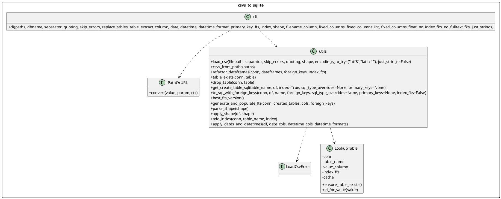

```plantuml
@startuml
skinparam classAttributeIconSize 0
skinparam packageStyle rectangle
skinparam shadowing false

package "csvs_to_sqlite" {
  class cli {
    +cli(paths, dbname, separator, quoting, skip_errors, replace_tables, table, extract_column, date, datetime, datetime_format, primary_key, fts, index, shape, filename_column, fixed_columns, fixed_columns_int, fixed_columns_float, no_index_fks, no_fulltext_fks, just_strings)
  }

  class LoadCsvError

  class PathOrURL {
    +convert(value, param, ctx)
  }

  class LookupTable {
    -conn
    -table_name
    -value_column
    -index_fts
    -cache
    +ensure_table_exists()
    +id_for_value(value)
  }

  class utils {
    +load_csv(filepath, separator, skip_errors, quoting, shape, encodings_to_try=("utf8","latin-1"), just_strings=False)
    +csvs_from_paths(paths)
    +refactor_dataframes(conn, dataframes, foreign_keys, index_fts)
    +table_exists(conn, table)
    +drop_table(conn, table)
    +get_create_table_sql(table_name, df, index=True, sql_type_overrides=None, primary_keys=None)
    +to_sql_with_foreign_keys(conn, df, name, foreign_keys, sql_type_overrides=None, primary_keys=None, index_fks=False)
    +best_fts_version()
    +generate_and_populate_fts(conn, created_tables, cols, foreign_keys)
    +parse_shape(shape)
    +apply_shape(df, shape)
    +add_index(conn, table_name, index)
    +apply_dates_and_datetimes(df, date_cols, datetime_cols, datetime_formats)
  }
}

cli ..> utils
cli ..> PathOrURL
utils ..> LookupTable
utils ..> LoadCsvError

@enduml
```