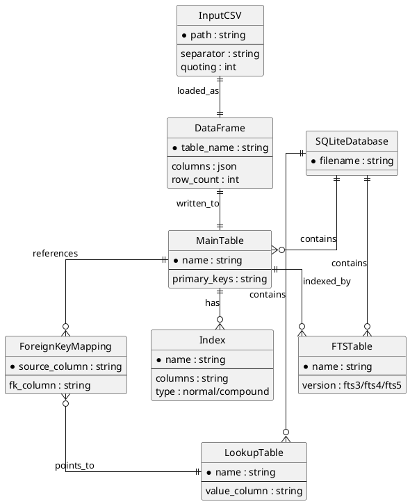

```plantuml
@startuml
skinparam linetype ortho
hide circle

entity "InputCSV" as CSV {
  * path : string
  --
  separator : string
  quoting : int
}

entity "DataFrame" as DF {
  * table_name : string
  --
  columns : json
  row_count : int
}

entity "MainTable" as MT {
  * name : string
  --
  primary_keys : string
}

entity "LookupTable" as LT {
  * name : string
  --
  value_column : string
}

entity "ForeignKeyMapping" as FKM {
  * source_column : string
  --
  fk_column : string
}

entity "Index" as IDX {
  * name : string
  --
  columns : string
  type : normal/compound
}

entity "FTSTable" as FTS {
  * name : string
  --
  version : fts3/fts4/fts5
}

entity "SQLiteDatabase" as DB {
  * filename : string
}

CSV ||--|| DF : loaded_as
DF ||--|| MT : written_to
MT ||--o{ IDX : has
MT ||--o{ FKM : references
FKM }o--|| LT : points_to
MT ||--o{ FTS : indexed_by
DB ||--o{ MT : contains
DB ||--o{ LT : contains
DB ||--o{ FTS : contains

@enduml
```