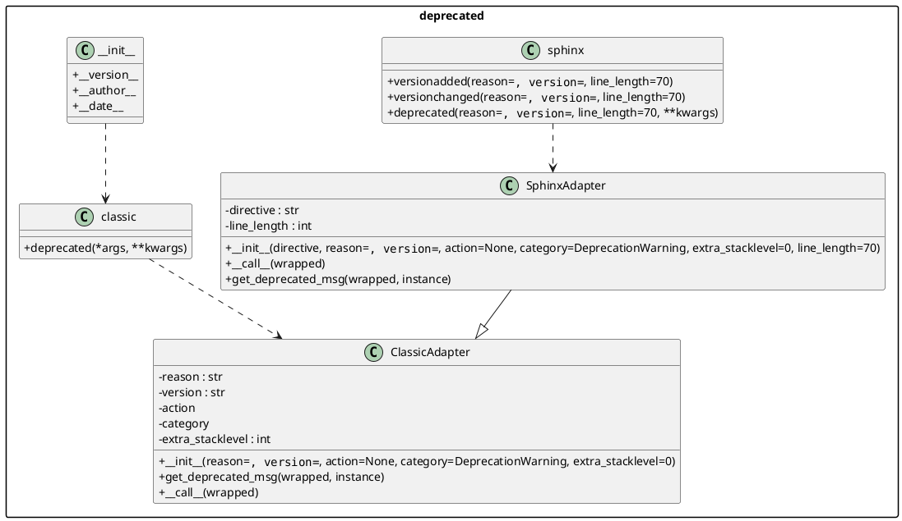

```plantuml
@startuml
skinparam classAttributeIconSize 0
skinparam packageStyle rectangle
skinparam shadowing false

package "deprecated" {
  class ClassicAdapter {
    -reason : str
    -version : str
    -action
    -category
    -extra_stacklevel : int
    +__init__(reason="", version="", action=None, category=DeprecationWarning, extra_stacklevel=0)
    +get_deprecated_msg(wrapped, instance)
    +__call__(wrapped)
  }

  class SphinxAdapter {
    -directive : str
    -line_length : int
    +__init__(directive, reason="", version="", action=None, category=DeprecationWarning, extra_stacklevel=0, line_length=70)
    +__call__(wrapped)
    +get_deprecated_msg(wrapped, instance)
  }

  class classic {
    +deprecated(*args, **kwargs)
  }

  class sphinx {
    +versionadded(reason="", version="", line_length=70)
    +versionchanged(reason="", version="", line_length=70)
    +deprecated(reason="", version="", line_length=70, **kwargs)
  }

  class __init__ {
    +__version__
    +__author__
    +__date__
  }
}

SphinxAdapter --|> ClassicAdapter
classic ..> ClassicAdapter
sphinx ..> SphinxAdapter
__init__ ..> classic

@enduml
```