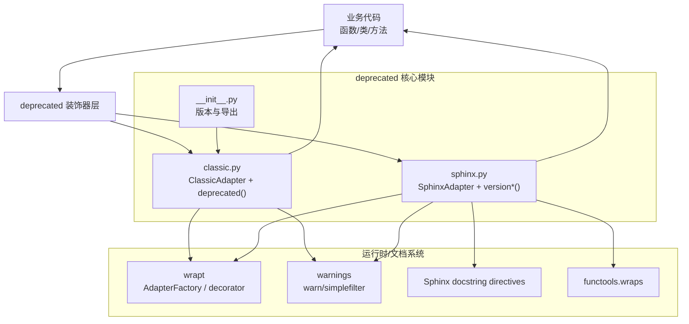

```mermaid
graph TB
    user["业务代码\n函数/类/方法"] --> decorators["deprecated 装饰器层"]

    subgraph core["deprecated 核心模块"]
      classic["classic.py\nClassicAdapter + deprecated()"]
      sphinx["sphinx.py\nSphinxAdapter + version*()"]
      init["__init__.py\n版本与导出"]
    end

    subgraph runtime["运行时/文档系统"]
      wrapt["wrapt\nAdapterFactory / decorator"]
      warnings["warnings\nwarn/simplefilter"]
      docs["Sphinx docstring directives"]
      functools["functools.wraps"]
    end

    decorators --> classic
    decorators --> sphinx
    init --> classic

    classic --> wrapt
    classic --> warnings

    sphinx --> wrapt
    sphinx --> warnings
    sphinx --> docs
    sphinx --> functools

    classic --> user
    sphinx --> user
```