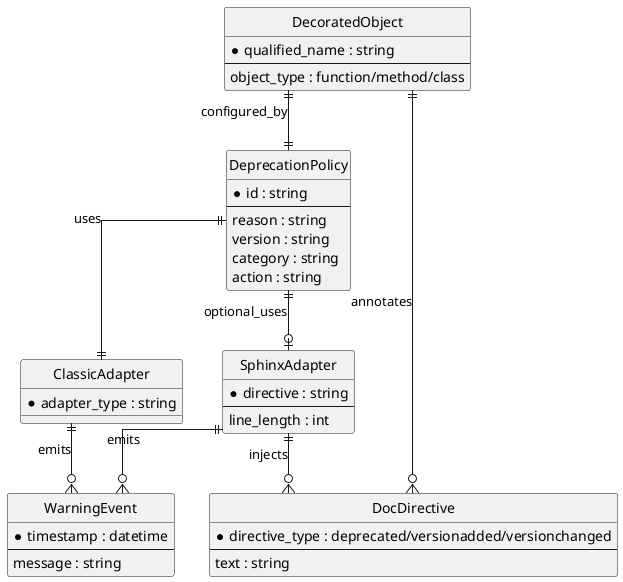

```plantuml
@startuml
skinparam linetype ortho
hide circle

entity "DecoratedObject" as Obj {
  * qualified_name : string
  --
  object_type : function/method/class
}

entity "DeprecationPolicy" as Pol {
  * id : string
  --
  reason : string
  version : string
  category : string
  action : string
}

entity "ClassicAdapter" as CA {
  * adapter_type : string
}

entity "SphinxAdapter" as SA {
  * directive : string
  --
  line_length : int
}

entity "WarningEvent" as Warn {
  * timestamp : datetime
  --
  message : string
}

entity "DocDirective" as Doc {
  * directive_type : deprecated/versionadded/versionchanged
  --
  text : string
}

Obj ||--|| Pol : configured_by
Pol ||--|| CA : uses
Pol ||--o| SA : optional_uses
CA ||--o{ Warn : emits
SA ||--o{ Warn : emits
SA ||--o{ Doc : injects
Doc }o--|| Obj : annotates

@enduml
```