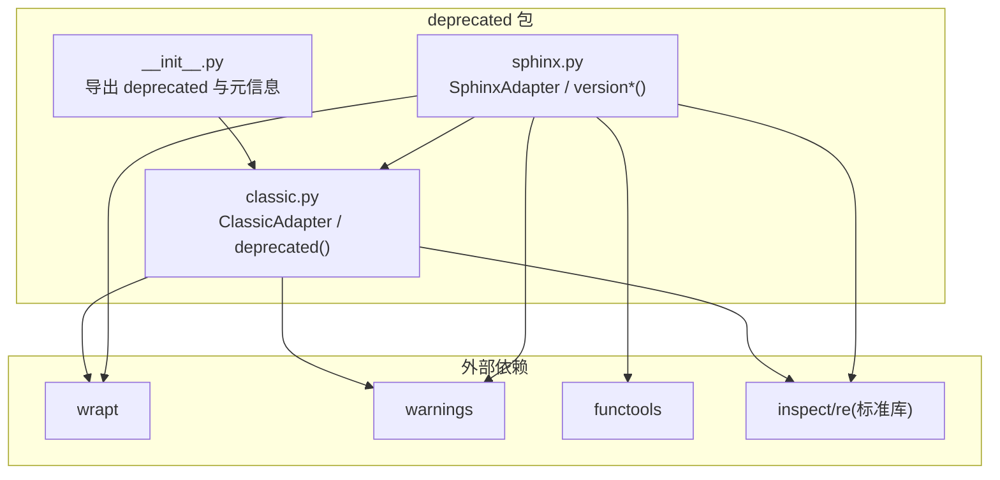

```mermaid
graph TB
    subgraph pkg["deprecated 包"]
      init["__init__.py\n导出 deprecated 与元信息"]
      classic["classic.py\nClassicAdapter / deprecated()"]
      sphinx["sphinx.py\nSphinxAdapter / version*()"]
    end

    subgraph deps["外部依赖"]
      wrapt["wrapt"]
      warnings["warnings"]
      functools["functools"]
      inspect["inspect/re(标准库)"]
    end

    init --> classic

    classic --> wrapt
    classic --> warnings
    classic --> inspect

    sphinx --> classic
    sphinx --> wrapt
    sphinx --> warnings
    sphinx --> functools
    sphinx --> inspect
```