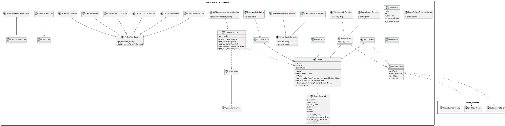

```plantuml
@startuml
skinparam classAttributeIconSize 0
skinparam packageStyle rectangle
skinparam shadowing false

package "rest_framework_simplejwt" {
  class JWTAuthentication {
    -user_model
    +authenticate(request)
    +get_header(request)
    +get_raw_token(header)
    +get_validated_token(raw_token)
    +get_user(validated_token)
  }

  class JWTStatelessUserAuthentication {
    +get_user(validated_token)
  }

  class TokenBackend {
    -algorithm
    -signing_key
    -verifying_key
    -audience
    -issuer
    -leeway
    +encode(payload)
    +decode(token, verify=True)
    +get_verifying_key(token)
    +get_leeway()
  }

  class Token {
    -token
    -payload
    -current_time
    +verify()
    +verify_token_type()
    +set_jti()
    +set_exp(claim="exp", from_time=None, lifetime=None)
    +set_iat(claim="iat", at_time=None)
    +check_exp(claim="exp", current_time=None)
    +for_user(user)
  }

  class AccessToken
  class RefreshToken {
    +access_token
  }
  class SlidingToken
  class UntypedToken

  class BlacklistMixin {
    +verify(...)
    +check_blacklist()
    +blacklist()
    +outstand()
  }

  class TokenUser {
    -token
    +id
    +username
    +is_authenticated
    +get_username()
  }

  class TokenObtainSerializer {
    +validate(attrs)
    +get_token(user)
  }

  class TokenObtainPairSerializer
  class TokenObtainSlidingSerializer
  class TokenRefreshSerializer {
    +validate(attrs)
  }
  class TokenRefreshSlidingSerializer {
    +validate(attrs)
  }
  class TokenVerifySerializer {
    +validate(attrs)
  }
  class TokenBlacklistSerializer {
    +validate(attrs)
  }

  class TokenViewBase {
    +get_serializer_class()
    +post(request, *args, **kwargs)
  }

  class TokenObtainPairView
  class TokenRefreshView
  class TokenObtainSlidingView
  class TokenRefreshSlidingView
  class TokenVerifyView
  class TokenBlacklistView

  class APISettings
  class TokenError
  class ExpiredTokenError
  class TokenBackendError
  class TokenBackendExpiredToken
  class InvalidToken
  class AuthenticationFailed
}

package "token_blacklist" {
  class OutstandingToken
  class BlacklistedToken
  class TokenBlacklistConfig
}

JWTStatelessUserAuthentication --|> JWTAuthentication
AccessToken --|> Token
RefreshToken --|> Token
SlidingToken --|> Token
UntypedToken --|> Token
RefreshToken ..|> BlacklistMixin
SlidingToken ..|> BlacklistMixin

TokenObtainPairSerializer --|> TokenObtainSerializer
TokenObtainSlidingSerializer --|> TokenObtainSerializer

TokenObtainPairView --|> TokenViewBase
TokenRefreshView --|> TokenViewBase
TokenObtainSlidingView --|> TokenViewBase
TokenRefreshSlidingView --|> TokenViewBase
TokenVerifyView --|> TokenViewBase
TokenBlacklistView --|> TokenViewBase

JWTAuthentication ..> Token
JWTAuthentication ..> InvalidToken
Token ..> TokenBackend
TokenRefreshSerializer ..> RefreshToken
TokenVerifySerializer ..> UntypedToken
TokenBlacklistSerializer ..> RefreshToken
BlacklistMixin ..> OutstandingToken
BlacklistMixin ..> BlacklistedToken

ExpiredTokenError --|> TokenError
TokenBackendExpiredToken --|> TokenBackendError
InvalidToken --|> AuthenticationFailed

@enduml
```