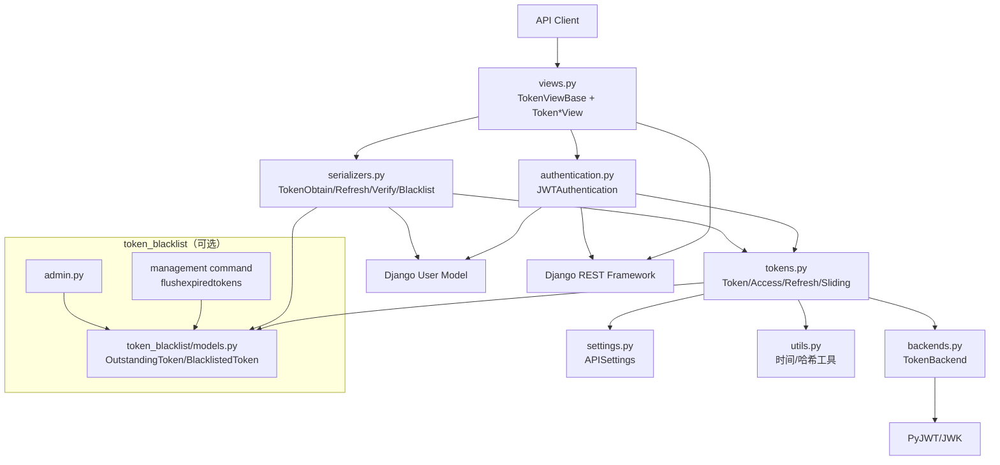

```mermaid
graph TB
    client["API Client"] --> views["views.py\nTokenViewBase + Token*View"]
    views --> serializers["serializers.py\nTokenObtain/Refresh/Verify/Blacklist"]
    views --> auth["authentication.py\nJWTAuthentication"]

    auth --> tokens["tokens.py\nToken/Access/Refresh/Sliding"]
    serializers --> tokens
    tokens --> backend["backends.py\nTokenBackend"]
    tokens --> settings["settings.py\nAPISettings"]
    tokens --> utils["utils.py\n时间/哈希工具"]

    auth --> usermodel["Django User Model"]
    serializers --> usermodel

    subgraph blacklist["token_blacklist（可选）"]
      blmodels["token_blacklist/models.py\nOutstandingToken/BlacklistedToken"]
      command["management command\nflushexpiredtokens"]
      admin["admin.py"]
    end

    tokens --> blmodels
    serializers --> blmodels
    command --> blmodels
    admin --> blmodels

    backend --> pyjwt["PyJWT/JWK"]
    views --> drf["Django REST Framework"]
    auth --> drf
```