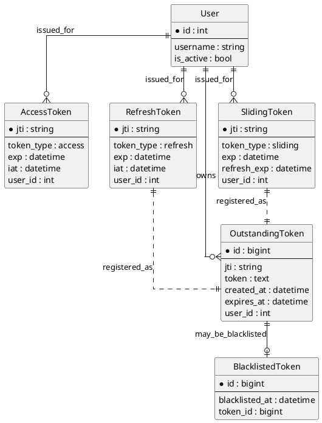

```plantuml
@startuml
skinparam linetype ortho
hide circle

entity "User" as U {
  * id : int
  --
  username : string
  is_active : bool
}

entity "AccessToken" as AT {
  * jti : string
  --
  token_type : access
  exp : datetime
  iat : datetime
  user_id : int
}

entity "RefreshToken" as RT {
  * jti : string
  --
  token_type : refresh
  exp : datetime
  iat : datetime
  user_id : int
}

entity "SlidingToken" as ST {
  * jti : string
  --
  token_type : sliding
  exp : datetime
  refresh_exp : datetime
  user_id : int
}

entity "OutstandingToken" as OT {
  * id : bigint
  --
  jti : string
  token : text
  created_at : datetime
  expires_at : datetime
  user_id : int
}

entity "BlacklistedToken" as BT {
  * id : bigint
  --
  blacklisted_at : datetime
  token_id : bigint
}

U ||--o{ OT : owns
OT ||--o| BT : may_be_blacklisted
U ||--o{ AT : issued_for
U ||--o{ RT : issued_for
U ||--o{ ST : issued_for
RT ||..|| OT : registered_as
ST ||..|| OT : registered_as

@enduml
```