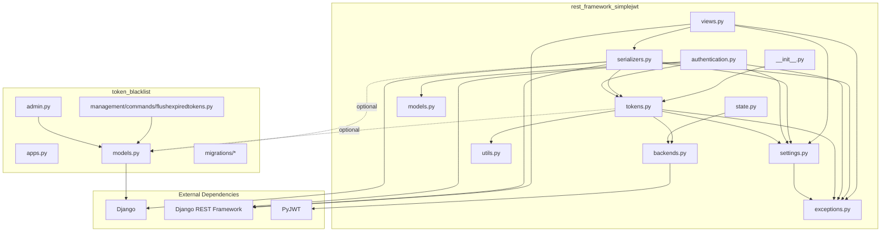

```mermaid
graph TD
    subgraph core["rest_framework_simplejwt"]
      init["__init__.py"]
      settings["settings.py"]
      state["state.py"]
      backend["backends.py"]
      tokens["tokens.py"]
      auth["authentication.py"]
      models["models.py"]
      serializers["serializers.py"]
      views["views.py"]
      exceptions["exceptions.py"]
      utils["utils.py"]
    end

    subgraph blacklist["token_blacklist"]
      blapps["apps.py"]
      blmodels["models.py"]
      bladmin["admin.py"]
      blmgmt["management/commands/flushexpiredtokens.py"]
      blmigrations["migrations/*"]
    end

    subgraph ext["External Dependencies"]
      django["Django"]
      drf["Django REST Framework"]
      pyjwt["PyJWT"]
    end

    settings --> exceptions
    state --> backend

    tokens --> backend
    tokens --> settings
    tokens --> utils
    tokens --> exceptions

    auth --> tokens
    auth --> models
    auth --> settings
    auth --> exceptions
    auth --> drf

    serializers --> tokens
    serializers --> settings
    serializers --> exceptions
    serializers --> django
    serializers --> drf

    views --> serializers
    views --> settings
    views --> exceptions
    views --> drf

    blmodels --> django
    bladmin --> blmodels
    blmgmt --> blmodels

    tokens -. optional .-> blmodels
    serializers -. optional .-> blmodels

    backend --> pyjwt
    init --> tokens
```