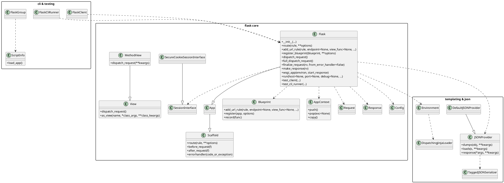

```plantuml
@startuml
skinparam classAttributeIconSize 0
skinparam packageStyle rectangle
skinparam shadowing false

package "flask core" {
  class Flask {
    +__init__(...)
    +route(rule, **options)
    +add_url_rule(rule, endpoint=None, view_func=None, ...)
    +register_blueprint(blueprint, **options)
    +dispatch_request()
    +full_dispatch_request()
    +finalize_request(rv, from_error_handler=False)
    +make_response(rv)
    +wsgi_app(environ, start_response)
    +run(host=None, port=None, debug=None, ...)
    +test_client(...)
    +test_cli_runner(...)
  }

  class App
  class Blueprint {
    +add_url_rule(rule, endpoint=None, view_func=None, ...)
    +register(app, options)
    +record(func)
  }

  class Scaffold {
    +route(rule, **options)
    +before_request(f)
    +after_request(f)
    +errorhandler(code_or_exception)
  }

  class AppContext {
    +push()
    +pop(exc=None)
    +copy()
  }

  class Request
  class Response
  class Config
  class SessionInterface
  class SecureCookieSessionInterface

  class View {
    +dispatch_request()
    +as_view(name, *class_args, **class_kwargs)
  }

  class MethodView {
    +dispatch_request(**kwargs)
  }
}

package "templating & json" {
  class Environment
  class DispatchingJinjaLoader
  class JSONProvider {
    +dumps(obj, **kwargs)
    +loads(s, **kwargs)
    +response(*args, **kwargs)
  }
  class DefaultJSONProvider
  class TaggedJSONSerializer
}

package "cli & testing" {
  class ScriptInfo {
    +load_app()
  }
  class FlaskGroup
  class FlaskClient
  class FlaskCliRunner
}

Flask --|> App
App --|> Scaffold
MethodView --|> View
SecureCookieSessionInterface --|> SessionInterface
DefaultJSONProvider --|> JSONProvider

Flask ..> Blueprint
Flask ..> AppContext
Flask ..> Request
Flask ..> Response
Flask ..> Config
Flask ..> SessionInterface
Flask ..> Environment
Environment ..> DispatchingJinjaLoader
Flask ..> JSONProvider
JSONProvider ..> TaggedJSONSerializer

FlaskGroup ..> ScriptInfo
FlaskClient ..> Flask
FlaskCliRunner ..> Flask

@enduml
```