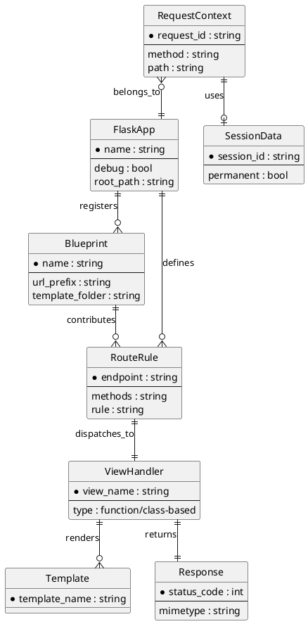

```plantuml
@startuml
skinparam linetype ortho
hide circle

entity "FlaskApp" as App {
  * name : string
  --
  debug : bool
  root_path : string
}

entity "Blueprint" as BP {
  * name : string
  --
  url_prefix : string
  template_folder : string
}

entity "RouteRule" as Rule {
  * endpoint : string
  --
  methods : string
  rule : string
}

entity "ViewHandler" as View {
  * view_name : string
  --
  type : function/class-based
}

entity "RequestContext" as ReqCtx {
  * request_id : string
  --
  method : string
  path : string
}

entity "SessionData" as Sess {
  * session_id : string
  --
  permanent : bool
}

entity "Template" as Tpl {
  * template_name : string
}

entity "Response" as Resp {
  * status_code : int
  --
  mimetype : string
}

App ||--o{ BP : registers
App ||--o{ Rule : defines
BP ||--o{ Rule : contributes
Rule ||--|| View : dispatches_to
ReqCtx }o--|| App : belongs_to
ReqCtx ||--o| Sess : uses
View ||--o{ Tpl : renders
View ||--|| Resp : returns

@enduml
```