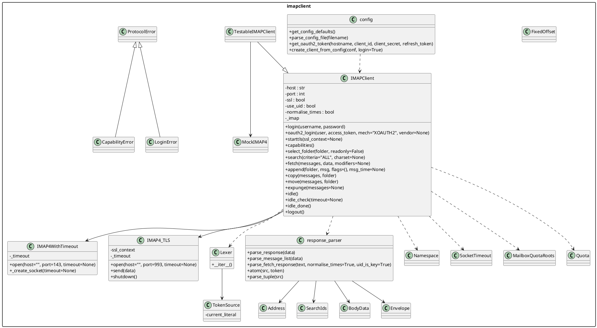

```plantuml
@startuml
skinparam classAttributeIconSize 0
skinparam packageStyle rectangle
skinparam shadowing false

package "imapclient" {
  class IMAPClient {
    -host : str
    -port : int
    -ssl : bool
    -use_uid : bool
    -normalise_times : bool
    -_imap
    +login(username, password)
    +oauth2_login(user, access_token, mech="XOAUTH2", vendor=None)
    +starttls(ssl_context=None)
    +capabilities()
    +select_folder(folder, readonly=False)
    +search(criteria="ALL", charset=None)
    +fetch(messages, data, modifiers=None)
    +append(folder, msg, flags=(), msg_time=None)
    +copy(messages, folder)
    +move(messages, folder)
    +expunge(messages=None)
    +idle()
    +idle_check(timeout=None)
    +idle_done()
    +logout()
  }

  class IMAP4WithTimeout {
    -_timeout
    +open(host="", port=143, timeout=None)
    +_create_socket(timeout=None)
  }

  class IMAP4_TLS {
    -ssl_context
    -_timeout
    +open(host="", port=993, timeout=None)
    +send(data)
    +shutdown()
  }

  class Lexer {
    +__iter__()
  }

  class TokenSource {
    -current_literal
  }

  class response_parser {
    +parse_response(data)
    +parse_message_list(data)
    +parse_fetch_response(text, normalise_times=True, uid_is_key=True)
    +atom(src, token)
    +parse_tuple(src)
  }

  class Envelope
  class Address
  class SearchIds
  class BodyData

  class Namespace
  class SocketTimeout
  class MailboxQuotaRoots
  class Quota

  class FixedOffset

  class config {
    +get_config_defaults()
    +parse_config_file(filename)
    +get_oauth2_token(hostname, client_id, client_secret, refresh_token)
    +create_client_from_config(conf, login=True)
  }

  class TestableIMAPClient
  class MockIMAP4

  class ProtocolError
  class CapabilityError
  class LoginError
}

IMAPClient --> IMAP4WithTimeout
IMAPClient --> IMAP4_TLS
IMAPClient ..> response_parser
IMAPClient ..> Lexer
Lexer --> TokenSource
response_parser --> Envelope
response_parser --> Address
response_parser --> SearchIds
response_parser --> BodyData

IMAPClient ..> Namespace
IMAPClient ..> Quota
IMAPClient ..> MailboxQuotaRoots
IMAPClient ..> SocketTimeout

TestableIMAPClient --|> IMAPClient
TestableIMAPClient --> MockIMAP4

ProtocolError <|-- CapabilityError
ProtocolError <|-- LoginError

config ..> IMAPClient

@enduml
```