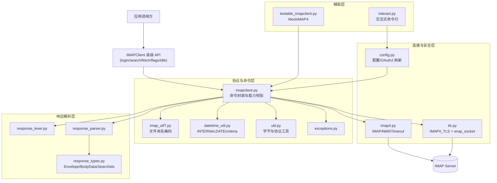

```mermaid
graph TB
    caller["应用调用方"] --> api["IMAPClient 高级 API\n(login/search/fetch/flags/idle)"]

    subgraph conn["连接与安全层"]
      imap4["imap4.py\nIMAP4WithTimeout"]
      tls["tls.py\nIMAP4_TLS + wrap_socket"]
      config["config.py\n配置/OAuth2 刷新"]
    end

    subgraph protocol["协议与命令层"]
      core["imapclient.py\n命令封装与能力校验"]
      utf7["imap_utf7.py\n文件夹名编码"]
      dt["datetime_util.py\nINTERNALDATE/criteria"]
      util["util.py\n字节与协议工具"]
      ex["exceptions.py"]
    end

    subgraph parser["响应解析层"]
      lexer["response_lexer.py"]
      parsermod["response_parser.py"]
      types["response_types.py\nEnvelope/BodyData/SearchIds"]
    end

    subgraph testcli["辅助层"]
      interact["interact.py\n交互式命令行"]
      testable["testable_imapclient.py\nMockIMAP4"]
    end

    server[("IMAP Server")]

    api --> core
    core --> imap4
    core --> tls
    core --> utf7
    core --> dt
    core --> util
    core --> ex
    core --> lexer
    core --> parsermod
    parsermod --> types

    config --> core
    interact --> config
    testable --> core

    imap4 --> server
    tls --> server
```