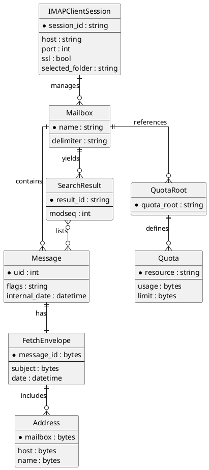

```plantuml
@startuml
skinparam linetype ortho
hide circle

entity "IMAPClientSession" as Session {
  * session_id : string
  --
  host : string
  port : int
  ssl : bool
  selected_folder : string
}

entity "Mailbox" as Mbox {
  * name : string
  --
  delimiter : string
}

entity "Message" as Msg {
  * uid : int
  --
  flags : string
  internal_date : datetime
}

entity "FetchEnvelope" as Env {
  * message_id : bytes
  --
  subject : bytes
  date : datetime
}

entity "Address" as Addr {
  * mailbox : bytes
  --
  host : bytes
  name : bytes
}

entity "QuotaRoot" as QR {
  * quota_root : string
}

entity "Quota" as Q {
  * resource : string
  --
  usage : bytes
  limit : bytes
}

entity "SearchResult" as SR {
  * result_id : string
  --
  modseq : int
}

Session ||--o{ Mbox : manages
Mbox ||--o{ Msg : contains
Msg ||--|| Env : has
Env ||--o{ Addr : includes
Mbox ||--o{ QR : references
QR ||--o{ Q : defines
Mbox ||--o{ SR : yields
SR }o--o{ Msg : lists

@enduml
```