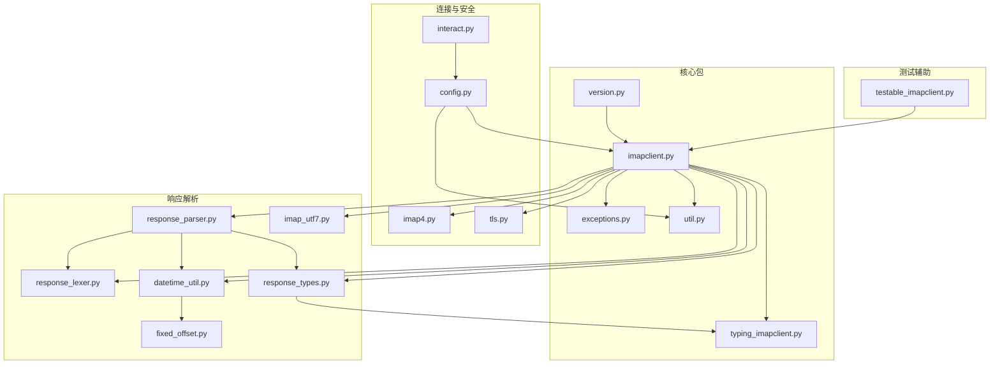

```mermaid
graph TD
    subgraph core["核心包"]
      imapclient_mod["imapclient.py"]
      exceptions["exceptions.py"]
      util["util.py"]
      typing_mod["typing_imapclient.py"]
      version["version.py"]
    end

    subgraph conn["连接与安全"]
      imap4["imap4.py"]
      tls["tls.py"]
      config["config.py"]
      interact["interact.py"]
    end

    subgraph parse["响应解析"]
      lexer["response_lexer.py"]
      parser["response_parser.py"]
      types["response_types.py"]
      dt["datetime_util.py"]
      utf7["imap_utf7.py"]
      fixed["fixed_offset.py"]
    end

    subgraph test["测试辅助"]
      testable["testable_imapclient.py"]
    end

    imapclient_mod --> imap4
    imapclient_mod --> tls
    imapclient_mod --> exceptions
    imapclient_mod --> util
    imapclient_mod --> parser
    imapclient_mod --> lexer
    imapclient_mod --> types
    imapclient_mod --> utf7
    imapclient_mod --> dt

    parser --> lexer
    parser --> types
    parser --> dt

    config --> imapclient_mod
    config --> util
    interact --> config

    dt --> fixed

    testable --> imapclient_mod

    imapclient_mod --> typing_mod
    types --> typing_mod
    version --> imapclient_mod
```