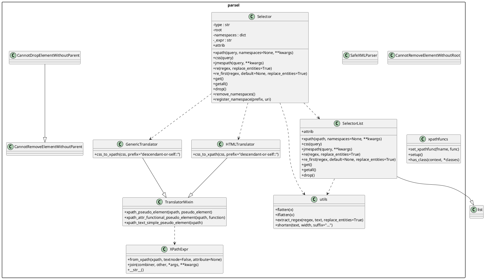

```plantuml
@startuml
skinparam classAttributeIconSize 0
skinparam packageStyle rectangle
skinparam shadowing false

package "parsel" {
  class Selector {
    -type : str
    -root
    -namespaces : dict
    -_expr : str
    +xpath(query, namespaces=None, **kwargs)
    +css(query)
    +jmespath(query, **kwargs)
    +re(regex, replace_entities=True)
    +re_first(regex, default=None, replace_entities=True)
    +get()
    +getall()
    +drop()
    +remove_namespaces()
    +register_namespace(prefix, uri)
    +attrib
  }

  class SelectorList {
    +xpath(xpath, namespaces=None, **kwargs)
    +css(query)
    +jmespath(query, **kwargs)
    +re(regex, replace_entities=True)
    +re_first(regex, default=None, replace_entities=True)
    +get()
    +getall()
    +drop()
    +attrib
  }

  class SafeXMLParser

  class XPathExpr {
    +from_xpath(xpath, textnode=False, attribute=None)
    +join(combiner, other, *args, **kwargs)
    +__str__()
  }

  class TranslatorMixin {
    +xpath_pseudo_element(xpath, pseudo_element)
    +xpath_attr_functional_pseudo_element(xpath, function)
    +xpath_text_simple_pseudo_element(xpath)
  }

  class GenericTranslator {
    +css_to_xpath(css, prefix="descendant-or-self::")
  }

  class HTMLTranslator {
    +css_to_xpath(css, prefix="descendant-or-self::")
  }

  class CannotRemoveElementWithoutRoot
  class CannotRemoveElementWithoutParent
  class CannotDropElementWithoutParent

  class utils {
    +flatten(x)
    +iflatten(x)
    +extract_regex(regex, text, replace_entities=True)
    +shorten(text, width, suffix="...")
  }

  class xpathfuncs {
    +set_xpathfunc(fname, func)
    +setup()
    +has_class(context, *classes)
  }
}

SelectorList --|> list
CannotDropElementWithoutParent --|> CannotRemoveElementWithoutParent
Selector ..> SelectorList
Selector ..> GenericTranslator
Selector ..> HTMLTranslator
Selector ..> utils
SelectorList ..> utils
GenericTranslator --|> TranslatorMixin
HTMLTranslator --|> TranslatorMixin
TranslatorMixin ..> XPathExpr

@enduml
```