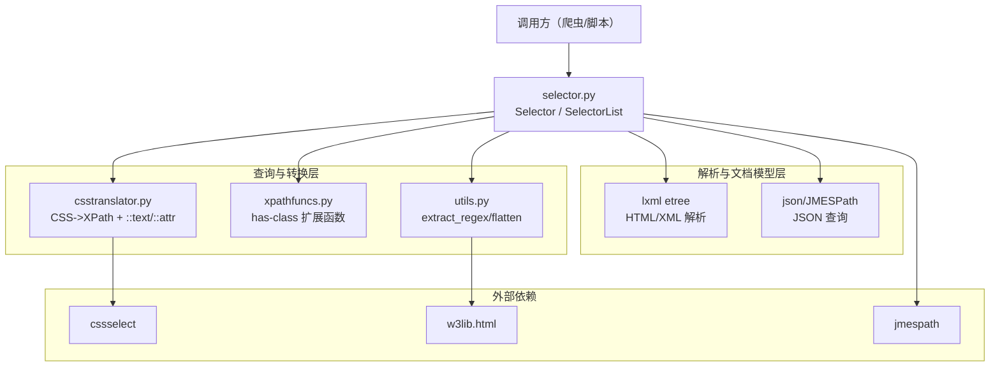

```mermaid
graph TB
    caller["调用方（爬虫/脚本）"] --> selector_api["selector.py\nSelector / SelectorList"]

    subgraph query["查询与转换层"]
      css_trans["csstranslator.py\nCSS->XPath + ::text/::attr"]
      xpath_ext["xpathfuncs.py\nhas-class 扩展函数"]
      regex_util["utils.py\nextract_regex/flatten"]
    end

    subgraph parse["解析与文档模型层"]
      lxml_parse["lxml etree\nHTML/XML 解析"]
      json_parse["json/JMESPath\nJSON 查询"]
    end

    subgraph ext["外部依赖"]
      cssselect["cssselect"]
      jmespath["jmespath"]
      w3lib["w3lib.html"]
    end

    selector_api --> css_trans
    selector_api --> xpath_ext
    selector_api --> regex_util
    selector_api --> lxml_parse
    selector_api --> json_parse

    css_trans --> cssselect
    selector_api --> jmespath
    regex_util --> w3lib
```