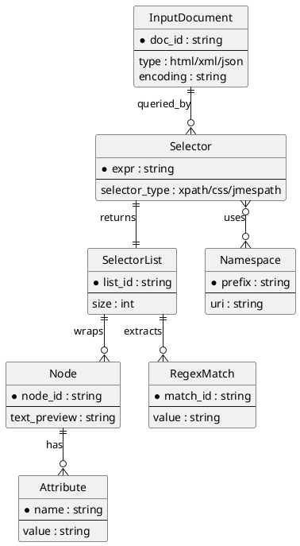

```plantuml
@startuml
skinparam linetype ortho
hide circle

entity "InputDocument" as Doc {
  * doc_id : string
  --
  type : html/xml/json
  encoding : string
}

entity "Selector" as Sel {
  * expr : string
  --
  selector_type : xpath/css/jmespath
}

entity "SelectorList" as SelList {
  * list_id : string
  --
  size : int
}

entity "Node" as Node {
  * node_id : string
  --
  text_preview : string
}

entity "Attribute" as Attr {
  * name : string
  --
  value : string
}

entity "RegexMatch" as Match {
  * match_id : string
  --
  value : string
}

entity "Namespace" as Ns {
  * prefix : string
  --
  uri : string
}

Doc ||--o{ Sel : queried_by
Sel ||--|| SelList : returns
SelList ||--o{ Node : wraps
Node ||--o{ Attr : has
SelList ||--o{ Match : extracts
Sel }o--o{ Ns : uses

@enduml
```