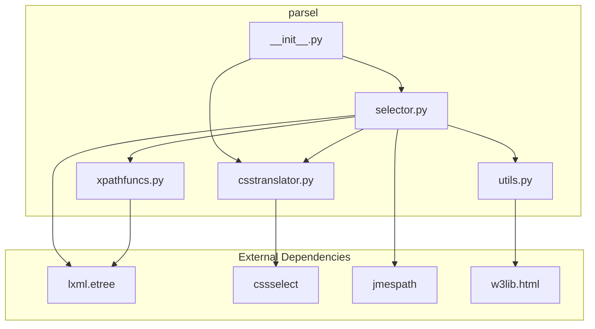

```mermaid
graph TD
    subgraph parsel_pkg["parsel"]
      init["__init__.py"]
      selector["selector.py"]
      css_trans["csstranslator.py"]
      xpathfuncs["xpathfuncs.py"]
      utils["utils.py"]
    end

    subgraph deps["External Dependencies"]
      lxml["lxml.etree"]
      cssselect["cssselect"]
      jmespath["jmespath"]
      w3lib["w3lib.html"]
    end

    init --> selector
    init --> css_trans

    selector --> css_trans
    selector --> xpathfuncs
    selector --> utils
    selector --> lxml
    selector --> jmespath

    css_trans --> cssselect
    utils --> w3lib
    xpathfuncs --> lxml
```