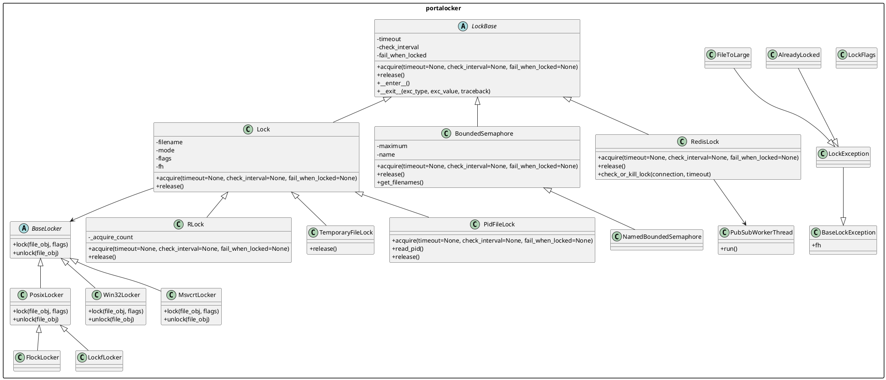

```plantuml
@startuml
skinparam classAttributeIconSize 0
skinparam packageStyle rectangle
skinparam shadowing false

package "portalocker" {
  class LockFlags

  class BaseLockException {
    +fh
  }
  class LockException
  class AlreadyLocked
  class FileToLarge

  abstract class BaseLocker {
    +lock(file_obj, flags)
    +unlock(file_obj)
  }

  class PosixLocker {
    +lock(file_obj, flags)
    +unlock(file_obj)
  }
  class FlockLocker
  class LockfLocker

  class Win32Locker {
    +lock(file_obj, flags)
    +unlock(file_obj)
  }
  class MsvcrtLocker {
    +lock(file_obj, flags)
    +unlock(file_obj)
  }

  abstract class LockBase {
    -timeout
    -check_interval
    -fail_when_locked
    +acquire(timeout=None, check_interval=None, fail_when_locked=None)
    +release()
    +__enter__()
    +__exit__(exc_type, exc_value, traceback)
  }

  class Lock {
    -filename
    -mode
    -flags
    -fh
    +acquire(timeout=None, check_interval=None, fail_when_locked=None)
    +release()
  }

  class RLock {
    -_acquire_count
    +acquire(timeout=None, check_interval=None, fail_when_locked=None)
    +release()
  }

  class TemporaryFileLock {
    +release()
  }

  class PidFileLock {
    +acquire(timeout=None, check_interval=None, fail_when_locked=None)
    +read_pid()
    +release()
  }

  class BoundedSemaphore {
    -maximum
    -name
    +acquire(timeout=None, check_interval=None, fail_when_locked=None)
    +release()
    +get_filenames()
  }

  class NamedBoundedSemaphore

  class RedisLock {
    +acquire(timeout=None, check_interval=None, fail_when_locked=None)
    +release()
    +check_or_kill_lock(connection, timeout)
  }

  class PubSubWorkerThread {
    +run()
  }
}

LockException --|> BaseLockException
AlreadyLocked --|> LockException
FileToLarge --|> LockException

BaseLocker <|-- PosixLocker
PosixLocker <|-- FlockLocker
PosixLocker <|-- LockfLocker
BaseLocker <|-- Win32Locker
BaseLocker <|-- MsvcrtLocker

LockBase <|-- Lock
Lock <|-- RLock
Lock <|-- TemporaryFileLock
Lock <|-- PidFileLock
LockBase <|-- BoundedSemaphore
BoundedSemaphore <|-- NamedBoundedSemaphore
LockBase <|-- RedisLock

RedisLock --> PubSubWorkerThread
Lock --> BaseLocker

@enduml
```