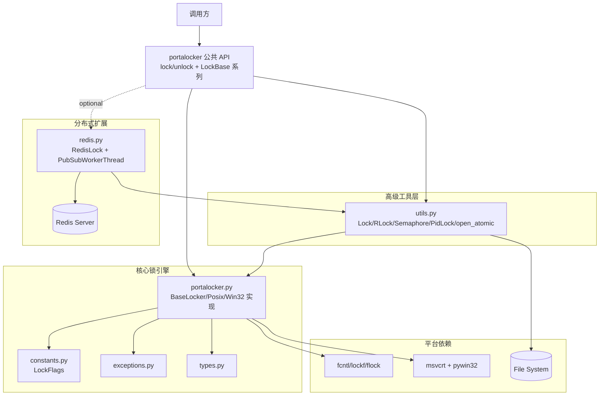

```mermaid
graph TB
    caller["调用方"] --> api["portalocker 公共 API\nlock/unlock + LockBase 系列"]

    subgraph core["核心锁引擎"]
      lockcore["portalocker.py\nBaseLocker/Posix/Win32 实现"]
      constants["constants.py\nLockFlags"]
      exceptions["exceptions.py"]
      types["types.py"]
    end

    subgraph utils_layer["高级工具层"]
      utils["utils.py\nLock/RLock/Semaphore/PidLock/open_atomic"]
    end

    subgraph redis_ext["分布式扩展"]
      redislock["redis.py\nRedisLock + PubSubWorkerThread"]
      redis_srv[("Redis Server")]
    end

    subgraph osdep["平台依赖"]
      posix["fcntl/lockf/flock"]
      win["msvcrt + pywin32"]
      fs[("File System")]
    end

    api --> utils
    api --> lockcore
    lockcore --> constants
    lockcore --> exceptions
    lockcore --> types
    utils --> lockcore
    utils --> fs

    lockcore --> posix
    lockcore --> win

    api -. optional .-> redislock
    redislock --> utils
    redislock --> redis_srv
```