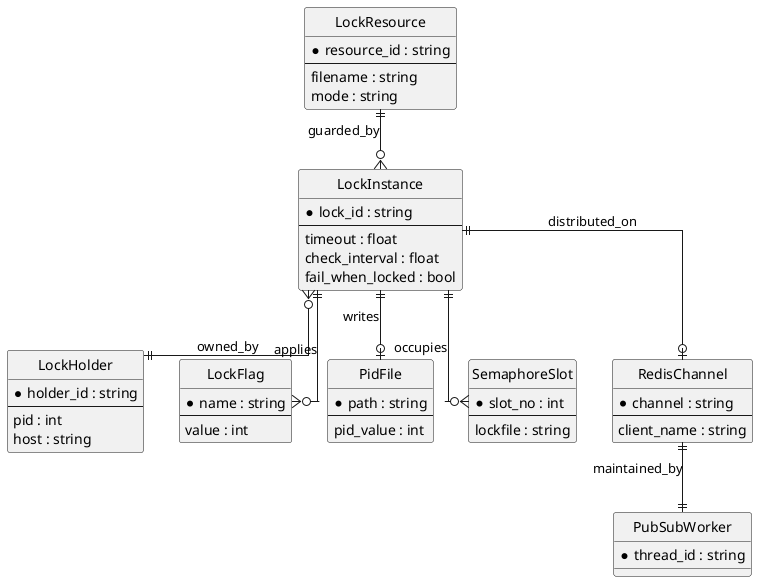

```plantuml
@startuml
skinparam linetype ortho
hide circle

entity "LockResource" as LR {
  * resource_id : string
  --
  filename : string
  mode : string
}

entity "LockInstance" as LI {
  * lock_id : string
  --
  timeout : float
  check_interval : float
  fail_when_locked : bool
}

entity "LockHolder" as Holder {
  * holder_id : string
  --
  pid : int
  host : string
}

entity "LockFlag" as Flag {
  * name : string
  --
  value : int
}

entity "PidFile" as PidF {
  * path : string
  --
  pid_value : int
}

entity "SemaphoreSlot" as Slot {
  * slot_no : int
  --
  lockfile : string
}

entity "RedisChannel" as RCh {
  * channel : string
  --
  client_name : string
}

entity "PubSubWorker" as Worker {
  * thread_id : string
}

LR ||--o{ LI : guarded_by
LI }o--|| Holder : owned_by
LI ||--o{ Flag : applies
LI ||--o| PidF : writes
LI ||--o{ Slot : occupies
LI ||--o| RCh : distributed_on
RCh ||--|| Worker : maintained_by

@enduml
```