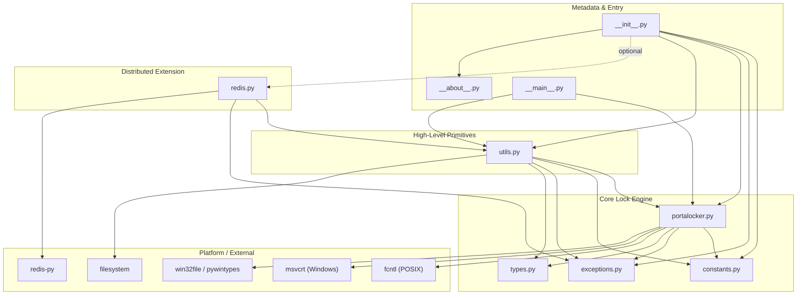

```mermaid
graph TD
    subgraph metadata["Metadata & Entry"]
      about["__about__.py"]
      init["__init__.py"]
      main["__main__.py"]
    end

    subgraph core["Core Lock Engine"]
      engine["portalocker.py"]
      constants["constants.py"]
      exceptions["exceptions.py"]
      types["types.py"]
    end

    subgraph highlevel["High-Level Primitives"]
      utils["utils.py"]
    end

    subgraph ext["Distributed Extension"]
      redis_mod["redis.py"]
    end

    subgraph platform["Platform / External"]
      fcntl["fcntl (POSIX)"]
      msvcrt["msvcrt (Windows)"]
      pywin32["win32file / pywintypes"]
      redis_client["redis-py"]
      fs["filesystem"]
    end

    init --> constants
    init --> exceptions
    init --> engine
    init --> utils
    init -. optional .-> redis_mod
    init --> about

    main --> engine
    main --> utils

    engine --> constants
    engine --> exceptions
    engine --> types

    utils --> engine
    utils --> constants
    utils --> exceptions
    utils --> types
    utils --> fs

    redis_mod --> utils
    redis_mod --> exceptions
    redis_mod --> redis_client

    engine --> fcntl
    engine --> msvcrt
    engine --> pywin32
```