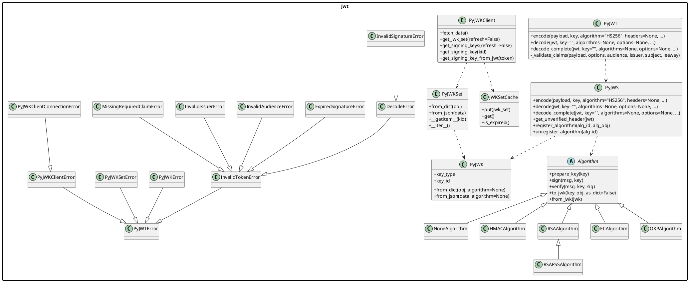

```plantuml
@startuml
skinparam classAttributeIconSize 0
skinparam packageStyle rectangle
skinparam shadowing false

package "jwt" {
  abstract class Algorithm {
    +prepare_key(key)
    +sign(msg, key)
    +verify(msg, key, sig)
    +to_jwk(key_obj, as_dict=False)
    +from_jwk(jwk)
  }

  class NoneAlgorithm
  class HMACAlgorithm
  class RSAAlgorithm
  class ECAlgorithm
  class RSAPSSAlgorithm
  class OKPAlgorithm

  class PyJWS {
    +encode(payload, key, algorithm="HS256", headers=None, ...)
    +decode(jwt, key="", algorithms=None, options=None, ...)
    +decode_complete(jwt, key="", algorithms=None, options=None, ...)
    +get_unverified_header(jwt)
    +register_algorithm(alg_id, alg_obj)
    +unregister_algorithm(alg_id)
  }

  class PyJWT {
    +encode(payload, key, algorithm="HS256", headers=None, ...)
    +decode(jwt, key="", algorithms=None, options=None, ...)
    +decode_complete(jwt, key="", algorithms=None, options=None, ...)
    -_validate_claims(payload, options, audience, issuer, subject, leeway)
  }

  class PyJWK {
    +from_dict(obj, algorithm=None)
    +from_json(data, algorithm=None)
    +key_type
    +key_id
  }

  class PyJWKSet {
    +from_dict(obj)
    +from_json(data)
    +__getitem__(kid)
    +__iter__()
  }

  class PyJWKClient {
    +fetch_data()
    +get_jwk_set(refresh=False)
    +get_signing_keys(refresh=False)
    +get_signing_key(kid)
    +get_signing_key_from_jwt(token)
  }

  class JWKSetCache {
    +put(jwk_set)
    +get()
    +is_expired()
  }

  class PyJWTError
  class InvalidTokenError
  class DecodeError
  class InvalidSignatureError
  class ExpiredSignatureError
  class InvalidAudienceError
  class InvalidIssuerError
  class MissingRequiredClaimError
  class PyJWKError
  class PyJWKSetError
  class PyJWKClientError
  class PyJWKClientConnectionError
}

Algorithm <|-- NoneAlgorithm
Algorithm <|-- HMACAlgorithm
Algorithm <|-- RSAAlgorithm
Algorithm <|-- ECAlgorithm
RSAAlgorithm <|-- RSAPSSAlgorithm
Algorithm <|-- OKPAlgorithm

PyJWT ..> PyJWS
PyJWS ..> Algorithm
PyJWS ..> PyJWK
PyJWKSet ..> PyJWK
PyJWKClient ..> PyJWKSet
PyJWKClient ..> JWKSetCache

InvalidTokenError --|> PyJWTError
DecodeError --|> InvalidTokenError
InvalidSignatureError --|> DecodeError
ExpiredSignatureError --|> InvalidTokenError
InvalidAudienceError --|> InvalidTokenError
InvalidIssuerError --|> InvalidTokenError
MissingRequiredClaimError --|> InvalidTokenError
PyJWKError --|> PyJWTError
PyJWKSetError --|> PyJWTError
PyJWKClientError --|> PyJWTError
PyJWKClientConnectionError --|> PyJWKClientError

@enduml
```