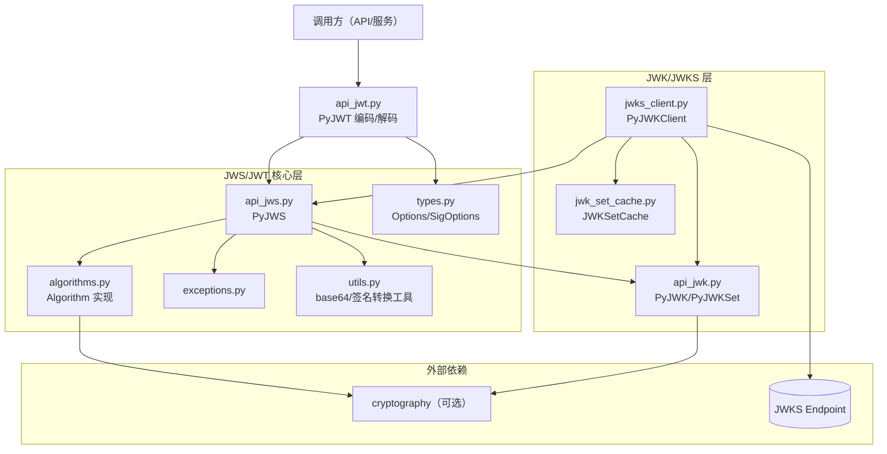

```mermaid
graph TB
    caller["调用方（API/服务）"] --> api["api_jwt.py\nPyJWT 编码/解码"]

    subgraph jws_layer["JWS/JWT 核心层"]
      jws["api_jws.py\nPyJWS"]
      alg["algorithms.py\nAlgorithm 实现"]
      exc["exceptions.py"]
      util["utils.py\nbase64/签名转换工具"]
      types["types.py\nOptions/SigOptions"]
    end

    subgraph jwk_layer["JWK/JWKS 层"]
      jwk["api_jwk.py\nPyJWK/PyJWKSet"]
      client["jwks_client.py\nPyJWKClient"]
      cache["jwk_set_cache.py\nJWKSetCache"]
    end

    subgraph ext["外部依赖"]
      crypto["cryptography（可选）"]
      remote[("JWKS Endpoint")]
    end

    api --> jws
    jws --> alg
    jws --> util
    jws --> exc
    api --> types

    jws --> jwk
    client --> jwk
    client --> cache
    client --> jws
    client --> remote

    alg --> crypto
    jwk --> crypto
```