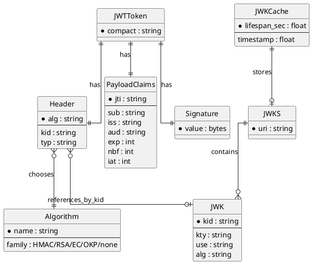

```plantuml
@startuml
skinparam linetype ortho
hide circle

entity "JWTToken" as Token {
  * compact : string
}

entity "Header" as Header {
  * alg : string
  --
  kid : string
  typ : string
}

entity "PayloadClaims" as Claims {
  * jti : string
  --
  sub : string
  iss : string
  aud : string
  exp : int
  nbf : int
  iat : int
}

entity "Signature" as Sig {
  * value : bytes
}

entity "Algorithm" as Alg {
  * name : string
  --
  family : HMAC/RSA/EC/OKP/none
}

entity "JWK" as Jwk {
  * kid : string
  --
  kty : string
  use : string
  alg : string
}

entity "JWKS" as Jwks {
  * uri : string
}

entity "JWKCache" as Cache {
  * lifespan_sec : float
  --
  timestamp : float
}

Token ||--|| Header : has
Token ||--|| Claims : has
Token ||--|| Sig : has
Header }o--|| Alg : chooses
Header }o--o| Jwk : references_by_kid
Jwks ||--o{ Jwk : contains
Cache ||--o| Jwks : stores

@enduml
```