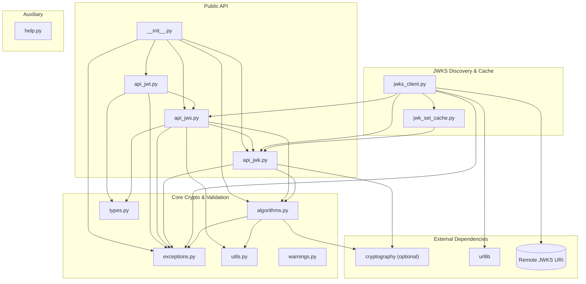

```mermaid
graph TD
    subgraph public_api["Public API"]
      init["__init__.py"]
      api_jwt["api_jwt.py"]
      api_jws["api_jws.py"]
      api_jwk["api_jwk.py"]
    end

    subgraph core["Core Crypto & Validation"]
      alg["algorithms.py"]
      exc["exceptions.py"]
      types["types.py"]
      util["utils.py"]
      warns["warnings.py"]
    end

    subgraph jwks["JWKS Discovery & Cache"]
      client["jwks_client.py"]
      cache["jwk_set_cache.py"]
    end

    subgraph aux["Auxiliary"]
      helpmod["help.py"]
    end

    subgraph deps["External Dependencies"]
      crypto["cryptography (optional)"]
      urllib["urllib"]
      remote[("Remote JWKS URI")]
    end

    init --> api_jwt
    init --> api_jws
    init --> api_jwk
    init --> alg
    init --> exc

    api_jwt --> api_jws
    api_jwt --> exc
    api_jwt --> types

    api_jws --> alg
    api_jws --> api_jwk
    api_jws --> util
    api_jws --> exc
    api_jws --> types

    api_jwk --> alg
    api_jwk --> exc

    client --> api_jwk
    client --> api_jws
    client --> cache
    client --> exc
    client --> urllib
    client --> remote

    cache --> api_jwk

    alg --> util
    alg --> exc
    alg --> crypto
    api_jwk --> crypto
```