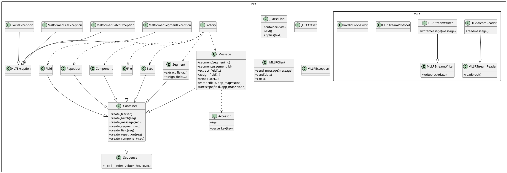

```plantuml
@startuml
skinparam classAttributeIconSize 0
skinparam packageStyle rectangle
skinparam shadowing false

package "hl7" {
  class Accessor {
    +parse_key(key)
    +key
  }

  class Sequence {
    +__call__(index, value=_SENTINEL)
  }

  class Container {
    +create_file(seq)
    +create_batch(seq)
    +create_message(seq)
    +create_segment(seq)
    +create_field(seq)
    +create_repetition(seq)
    +create_component(seq)
  }

  class File
  class Batch
  class Message {
    +segment(segment_id)
    +segments(segment_id)
    +extract_field(...)
    +assign_field(...)
    +create_ack(...)
    +escape(field, app_map=None)
    +unescape(field, app_map=None)
  }
  class Segment {
    +extract_field(...)
    +assign_field(...)
  }
  class Field
  class Repetition
  class Component
  class Factory

  class _ParsePlan {
    +container(data)
    +next()
    +applies(text)
  }

  class _UTCOffset

  class HL7Exception
  class MalformedSegmentException
  class MalformedBatchException
  class MalformedFileException
  class ParseException

  class MLLPClient {
    +send_message(message)
    +send(data)
    +close()
  }
  class MLLPException
}

package "hl7.mllp" {
  class MLLPStreamReader {
    +readblock()
  }
  class MLLPStreamWriter {
    +writeblock(data)
  }
  class HL7StreamReader {
    +readmessage()
  }
  class HL7StreamWriter {
    +writemessage(message)
  }
  class HL7StreamProtocol
  class InvalidBlockError
}

Container --|> Sequence
File --|> Container
Batch --|> Container
Message --|> Container
Segment --|> Container
Field --|> Container
Repetition --|> Container
Component --|> Container

MalformedSegmentException --|> HL7Exception
MalformedBatchException --|> HL7Exception
MalformedFileException --|> HL7Exception
ParseException --|> HL7Exception

HL7StreamReader --|> MLLPStreamReader
HL7StreamWriter --|> MLLPStreamWriter

Message ..> Accessor
Factory ..> File
Factory ..> Batch
Factory ..> Message
Factory ..> Segment
Factory ..> Field
Factory ..> Repetition
Factory ..> Component

@enduml
```