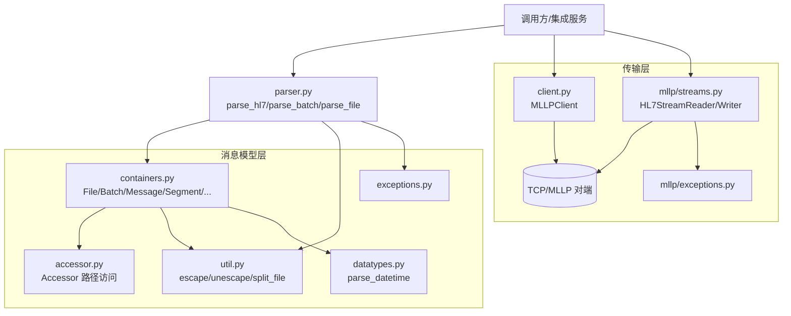

```mermaid
graph TB
    caller["调用方/集成服务"] --> parser_api["parser.py\nparse_hl7/parse_batch/parse_file"]

    subgraph model["消息模型层"]
      containers["containers.py\nFile/Batch/Message/Segment/... "]
      accessor["accessor.py\nAccessor 路径访问"]
      util["util.py\nescape/unescape/split_file"]
      datatypes["datatypes.py\nparse_datetime"]
      exceptions["exceptions.py"]
    end

    subgraph transport["传输层"]
      sync_client["client.py\nMLLPClient"]
      async_mllp["mllp/streams.py\nHL7StreamReader/Writer"]
      mllp_ex["mllp/exceptions.py"]
      network[("TCP/MLLP 对端")]
    end

    parser_api --> containers
    parser_api --> util
    parser_api --> exceptions

    containers --> accessor
    containers --> util
    containers --> datatypes

    caller --> sync_client
    caller --> async_mllp
    sync_client --> network
    async_mllp --> network
    async_mllp --> mllp_ex
```