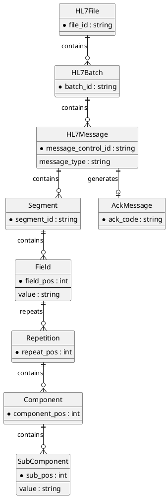

```plantuml
@startuml
skinparam linetype ortho
hide circle

entity "HL7File" as File {
  * file_id : string
}

entity "HL7Batch" as Batch {
  * batch_id : string
}

entity "HL7Message" as Msg {
  * message_control_id : string
  --
  message_type : string
}

entity "Segment" as Seg {
  * segment_id : string
}

entity "Field" as Fld {
  * field_pos : int
  --
  value : string
}

entity "Repetition" as Rep {
  * repeat_pos : int
}

entity "Component" as Comp {
  * component_pos : int
}

entity "SubComponent" as Sub {
  * sub_pos : int
  --
  value : string
}

entity "AckMessage" as Ack {
  * ack_code : string
}

File ||--o{ Batch : contains
Batch ||--o{ Msg : contains
Msg ||--o{ Seg : contains
Seg ||--o{ Fld : contains
Fld ||--o{ Rep : repeats
Rep ||--o{ Comp : contains
Comp ||--o{ Sub : contains
Msg ||--o| Ack : generates

@enduml
```