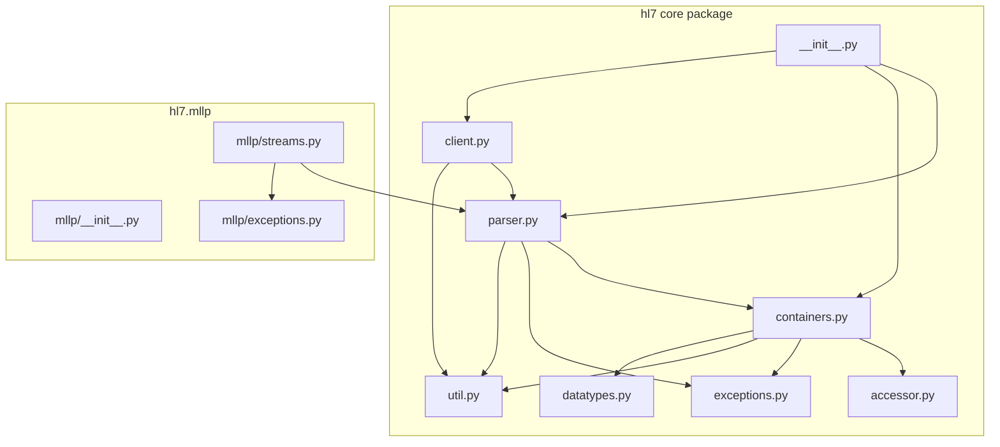

```mermaid
graph TD
    subgraph core_pkg["hl7 core package"]
      init["__init__.py"]
      parser["parser.py"]
      containers["containers.py"]
      accessor["accessor.py"]
      util["util.py"]
      datatypes["datatypes.py"]
      exceptions["exceptions.py"]
      client["client.py"]
    end

    subgraph mllp_pkg["hl7.mllp"]
      mllp_init["mllp/__init__.py"]
      mllp_streams["mllp/streams.py"]
      mllp_ex["mllp/exceptions.py"]
    end

    parser --> containers
    parser --> exceptions
    parser --> util

    containers --> accessor
    containers --> exceptions
    containers --> util
    containers --> datatypes

    client --> parser
    client --> util

    mllp_streams --> parser
    mllp_streams --> mllp_ex

    init --> parser
    init --> containers
    init --> client
```