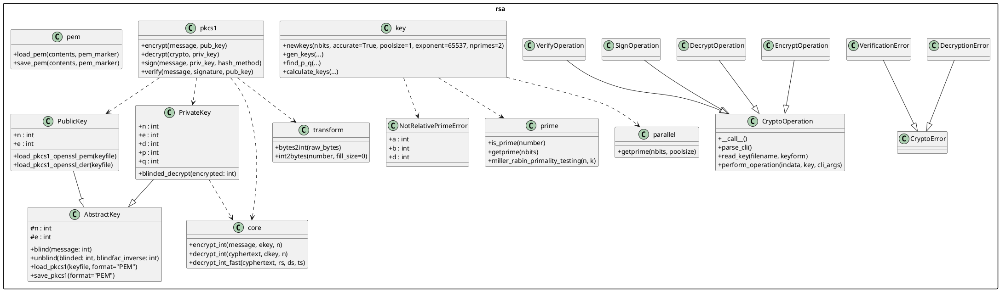

```plantuml
@startuml
skinparam classAttributeIconSize 0
skinparam packageStyle rectangle
skinparam shadowing false

package "rsa" {
  class AbstractKey {
    #n : int
    #e : int
    +blind(message: int)
    +unblind(blinded: int, blindfac_inverse: int)
    +load_pkcs1(keyfile, format="PEM")
    +save_pkcs1(format="PEM")
  }

  class PublicKey {
    +n : int
    +e : int
    +load_pkcs1_openssl_pem(keyfile)
    +load_pkcs1_openssl_der(keyfile)
  }

  class PrivateKey {
    +n : int
    +e : int
    +d : int
    +p : int
    +q : int
    +blinded_decrypt(encrypted: int)
  }

  class CryptoError
  class DecryptionError
  class VerificationError

  class NotRelativePrimeError {
    +a : int
    +b : int
    +d : int
  }

  class CryptoOperation {
    +__call__()
    +parse_cli()
    +read_key(filename, keyform)
    +perform_operation(indata, key, cli_args)
  }

  class EncryptOperation
  class DecryptOperation
  class SignOperation
  class VerifyOperation

  class core {
    +encrypt_int(message, ekey, n)
    +decrypt_int(cyphertext, dkey, n)
    +decrypt_int_fast(cyphertext, rs, ds, ts)
  }

  class key {
    +newkeys(nbits, accurate=True, poolsize=1, exponent=65537, nprimes=2)
    +gen_keys(...)
    +find_p_q(...)
    +calculate_keys(...)
  }

  class pkcs1 {
    +encrypt(message, pub_key)
    +decrypt(crypto, priv_key)
    +sign(message, priv_key, hash_method)
    +verify(message, signature, pub_key)
  }

  class prime {
    +is_prime(number)
    +getprime(nbits)
    +miller_rabin_primality_testing(n, k)
  }

  class parallel {
    +getprime(nbits, poolsize)
  }

  class pem {
    +load_pem(contents, pem_marker)
    +save_pem(contents, pem_marker)
  }

  class transform {
    +bytes2int(raw_bytes)
    +int2bytes(number, fill_size=0)
  }
}

PublicKey --|> AbstractKey
PrivateKey --|> AbstractKey

DecryptionError --|> CryptoError
VerificationError --|> CryptoError

EncryptOperation --|> CryptoOperation
DecryptOperation --|> CryptoOperation
SignOperation --|> CryptoOperation
VerifyOperation --|> CryptoOperation

pkcs1 ..> core
pkcs1 ..> transform
pkcs1 ..> PublicKey
pkcs1 ..> PrivateKey

key ..> prime
key ..> parallel
key ..> NotRelativePrimeError
PrivateKey ..> core

@enduml
```