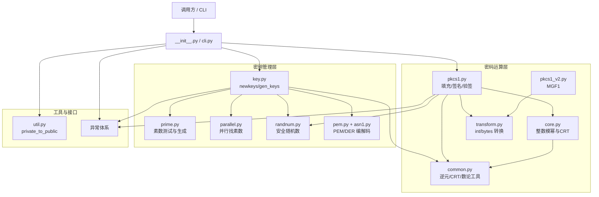

```mermaid
graph TB
    caller["调用方 / CLI"] --> api["__init__.py / cli.py"]

    subgraph key_mgmt["密钥管理层"]
      keymod["key.py\nnewkeys/gen_keys"]
      prime["prime.py\n素数测试与生成"]
      parallel["parallel.py\n并行找素数"]
      rand["randnum.py\n安全随机数"]
      pem["pem.py + asn1.py\nPEM/DER 编解码"]
    end

    subgraph crypto_core["密码运算层"]
      pkcs1["pkcs1.py\n填充/签名/验签"]
      core["core.py\n整数模幂与CRT"]
      transform["transform.py\nint/bytes 转换"]
      common["common.py\n逆元/CRT/数论工具"]
      pkcs1v2["pkcs1_v2.py\nMGF1"]
    end

    subgraph util_layer["工具与接口"]
      util["util.py\nprivate_to_public"]
      exceptions["异常体系"]
    end

    api --> keymod
    api --> pkcs1
    api --> util

    keymod --> prime
    keymod --> parallel
    keymod --> rand
    keymod --> common
    keymod --> pem

    pkcs1 --> core
    pkcs1 --> transform
    pkcs1 --> common
    pkcs1 --> rand

    core --> common
    pkcs1v2 --> transform

    api --> exceptions
    keymod --> exceptions
    pkcs1 --> exceptions
```