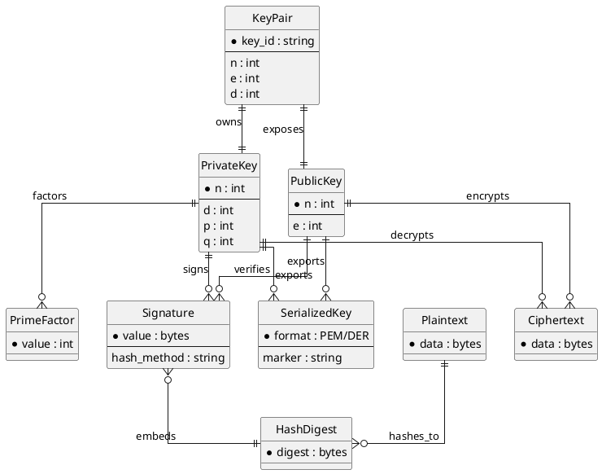

```plantuml
@startuml
skinparam linetype ortho
hide circle

entity "KeyPair" as KP {
  * key_id : string
  --
  n : int
  e : int
  d : int
}

entity "PublicKey" as Pub {
  * n : int
  --
  e : int
}

entity "PrivateKey" as Priv {
  * n : int
  --
  d : int
  p : int
  q : int
}

entity "PrimeFactor" as Prime {
  * value : int
}

entity "Plaintext" as PT {
  * data : bytes
}

entity "Ciphertext" as CT {
  * data : bytes
}

entity "Signature" as Sig {
  * value : bytes
  --
  hash_method : string
}

entity "HashDigest" as Dig {
  * digest : bytes
}

entity "SerializedKey" as Ser {
  * format : PEM/DER
  --
  marker : string
}

KP ||--|| Pub : exposes
KP ||--|| Priv : owns
Priv ||--o{ Prime : factors
Pub ||--o{ CT : encrypts
Priv ||--o{ CT : decrypts
Priv ||--o{ Sig : signs
Pub ||--o{ Sig : verifies
PT ||--o{ Dig : hashes_to
Sig }o--|| Dig : embeds
Pub ||--o{ Ser : exports
Priv ||--o{ Ser : exports

@enduml
```