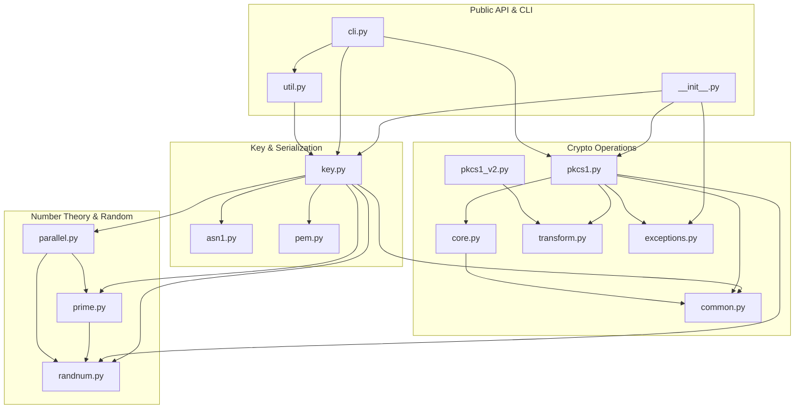

```mermaid
graph TD
    subgraph public_api["Public API & CLI"]
      init["__init__.py"]
      cli["cli.py"]
      util["util.py"]
    end

    subgraph key_layer["Key & Serialization"]
      keymod["key.py"]
      asn1["asn1.py"]
      pem["pem.py"]
    end

    subgraph crypto_layer["Crypto Operations"]
      pkcs1["pkcs1.py"]
      pkcs1v2["pkcs1_v2.py"]
      core["core.py"]
      transform["transform.py"]
      common["common.py"]
      exceptions["exceptions.py"]
    end

    subgraph number_layer["Number Theory & Random"]
      prime["prime.py"]
      randnum["randnum.py"]
      parallel["parallel.py"]
    end

    init --> keymod
    init --> pkcs1
    init --> exceptions

    cli --> keymod
    cli --> pkcs1
    cli --> util

    util --> keymod

    keymod --> prime
    keymod --> parallel
    keymod --> randnum
    keymod --> common
    keymod --> pem
    keymod --> asn1

    pkcs1 --> core
    pkcs1 --> transform
    pkcs1 --> common
    pkcs1 --> randnum
    pkcs1 --> exceptions

    core --> common
    pkcs1v2 --> transform

    prime --> randnum
    parallel --> prime
    parallel --> randnum
```