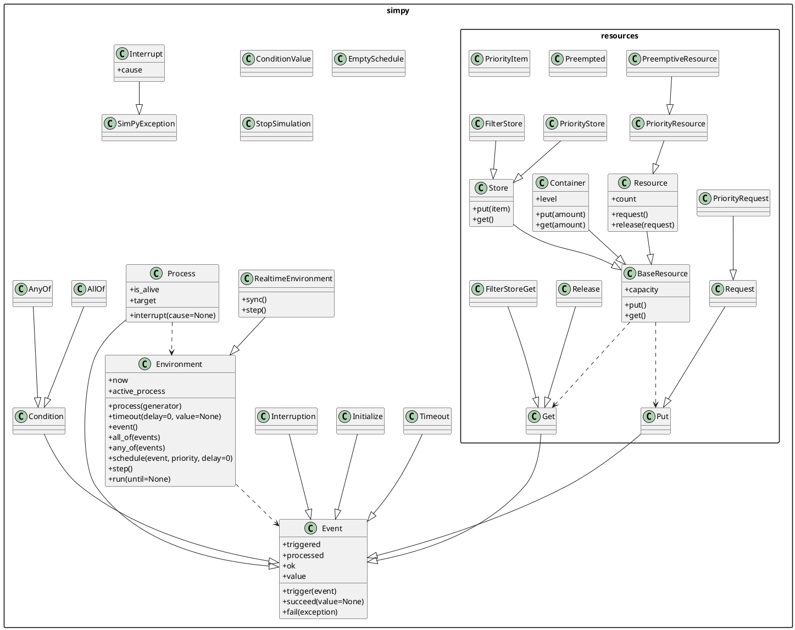

```plantuml
@startuml
skinparam classAttributeIconSize 0
skinparam packageStyle rectangle
skinparam shadowing false

package "simpy" {
  class Environment {
    +now
    +active_process
    +process(generator)
    +timeout(delay=0, value=None)
    +event()
    +all_of(events)
    +any_of(events)
    +schedule(event, priority, delay=0)
    +step()
    +run(until=None)
  }

  class RealtimeEnvironment {
    +sync()
    +step()
  }

  class Event {
    +trigger(event)
    +succeed(value=None)
    +fail(exception)
    +triggered
    +processed
    +ok
    +value
  }

  class Timeout
  class Initialize
  class Interruption
  class Process {
    +interrupt(cause=None)
    +is_alive
    +target
  }

  class Condition
  class AllOf
  class AnyOf
  class ConditionValue

  class SimPyException
  class Interrupt {
    +cause
  }

  class EmptySchedule
  class StopSimulation
}

package "simpy.resources" {
  class BaseResource {
    +capacity
    +put()
    +get()
  }

  class Put
  class Get

  class Resource {
    +request()
    +release(request)
    +count
  }
  class PriorityResource
  class PreemptiveResource

  class Request
  class PriorityRequest
  class Release
  class Preempted

  class Container {
    +put(amount)
    +get(amount)
    +level
  }

  class Store {
    +put(item)
    +get()
  }
  class PriorityStore
  class FilterStore
  class FilterStoreGet
  class PriorityItem
}

RealtimeEnvironment --|> Environment
Timeout --|> Event
Initialize --|> Event
Interruption --|> Event
Process --|> Event
Condition --|> Event
AllOf --|> Condition
AnyOf --|> Condition
Interrupt --|> SimPyException

Put --|> Event
Get --|> Event
Request --|> Put
PriorityRequest --|> Request
Release --|> Get

Resource --|> BaseResource
PriorityResource --|> Resource
PreemptiveResource --|> PriorityResource

Container --|> BaseResource
Store --|> BaseResource
PriorityStore --|> Store
FilterStore --|> Store
FilterStoreGet --|> Get

Environment ..> Event
Process ..> Environment
BaseResource ..> Put
BaseResource ..> Get

@enduml
```