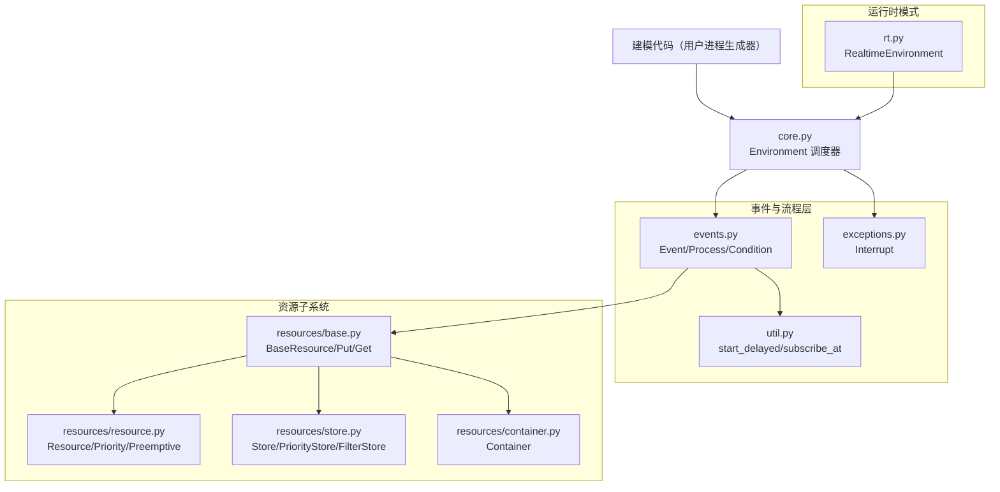

```mermaid
graph TB
    modeler["建模代码（用户进程生成器）"] --> env["core.py\nEnvironment 调度器"]

    subgraph events_layer["事件与流程层"]
      events["events.py\nEvent/Process/Condition"]
      util["util.py\nstart_delayed/subscribe_at"]
      exceptions["exceptions.py\nInterrupt"]
    end

    subgraph resources_layer["资源子系统"]
      base["resources/base.py\nBaseResource/Put/Get"]
      resource_mod["resources/resource.py\nResource/Priority/Preemptive"]
      store_mod["resources/store.py\nStore/PriorityStore/FilterStore"]
      container_mod["resources/container.py\nContainer"]
    end

    subgraph runtime_layer["运行时模式"]
      realtime["rt.py\nRealtimeEnvironment"]
    end

    env --> events
    env --> exceptions
    events --> util
    events --> base

    base --> resource_mod
    base --> store_mod
    base --> container_mod

    realtime --> env
```