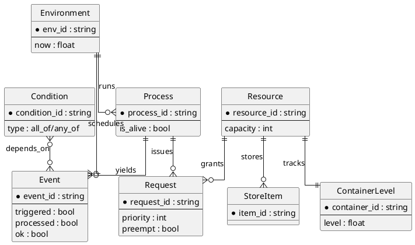

```plantuml
@startuml
skinparam linetype ortho
hide circle

entity "Environment" as Env {
  * env_id : string
  --
  now : float
}

entity "Process" as Proc {
  * process_id : string
  --
  is_alive : bool
}

entity "Event" as Ev {
  * event_id : string
  --
  triggered : bool
  processed : bool
  ok : bool
}

entity "Condition" as Cond {
  * condition_id : string
  --
  type : all_of/any_of
}

entity "Resource" as Res {
  * resource_id : string
  --
  capacity : int
}

entity "Request" as Req {
  * request_id : string
  --
  priority : int
  preempt : bool
}

entity "StoreItem" as Item {
  * item_id : string
}

entity "ContainerLevel" as Level {
  * container_id : string
  --
  level : float
}

Env ||--o{ Proc : runs
Env ||--o{ Ev : schedules
Proc ||--o{ Ev : yields
Cond }o--o{ Ev : depends_on
Res ||--o{ Req : grants
Proc ||--o{ Req : issues
Res ||--o{ Item : stores
Res ||--|| Level : tracks

@enduml
```