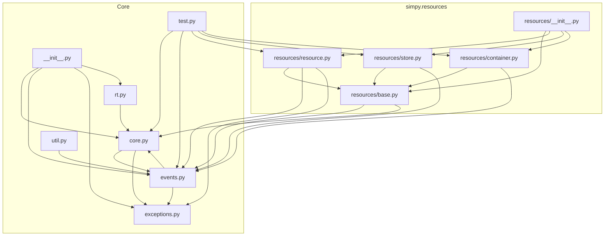

```mermaid
graph TD
    subgraph core_pkg["Core"]
      init["__init__.py"]
      core["core.py"]
      events["events.py"]
      exceptions["exceptions.py"]
      util["util.py"]
      rt["rt.py"]
      test["test.py"]
    end

    subgraph resources_pkg["simpy.resources"]
      rinit["resources/__init__.py"]
      base["resources/base.py"]
      resource["resources/resource.py"]
      store["resources/store.py"]
      container["resources/container.py"]
    end

    init --> core
    init --> events
    init --> exceptions
    init --> rt

    core --> events
    core --> exceptions

    events --> core
    events --> exceptions

    util --> events

    rt --> core

    base --> events
    base --> core

    resource --> base
    resource --> events
    resource --> exceptions

    store --> base
    store --> events

    container --> base
    container --> events

    rinit --> base
    rinit --> resource
    rinit --> store
    rinit --> container

    test --> core
    test --> events
    test --> resource
    test --> store
    test --> container
```