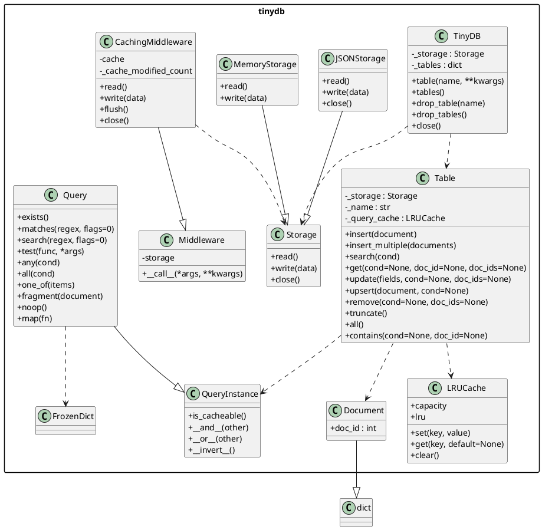

```plantuml
@startuml
skinparam classAttributeIconSize 0
skinparam packageStyle rectangle
skinparam shadowing false

package "tinydb" {
  class TinyDB {
    -_storage : Storage
    -_tables : dict
    +table(name, **kwargs)
    +tables()
    +drop_table(name)
    +drop_tables()
    +close()
  }

  class Table {
    -_storage : Storage
    -_name : str
    -_query_cache : LRUCache
    +insert(document)
    +insert_multiple(documents)
    +search(cond)
    +get(cond=None, doc_id=None, doc_ids=None)
    +update(fields, cond=None, doc_ids=None)
    +upsert(document, cond=None)
    +remove(cond=None, doc_ids=None)
    +truncate()
    +all()
    +contains(cond=None, doc_id=None)
  }

  class Document {
    +doc_id : int
  }

  class Storage {
    +read()
    +write(data)
    +close()
  }

  class JSONStorage {
    +read()
    +write(data)
    +close()
  }

  class MemoryStorage {
    +read()
    +write(data)
  }

  class Middleware {
    -storage
    +__call__(*args, **kwargs)
  }

  class CachingMiddleware {
    -cache
    -_cache_modified_count
    +read()
    +write(data)
    +flush()
    +close()
  }

  class QueryInstance {
    +is_cacheable()
    +__and__(other)
    +__or__(other)
    +__invert__()
  }

  class Query {
    +exists()
    +matches(regex, flags=0)
    +search(regex, flags=0)
    +test(func, *args)
    +any(cond)
    +all(cond)
    +one_of(items)
    +fragment(document)
    +noop()
    +map(fn)
  }

  class LRUCache {
    +capacity
    +lru
    +set(key, value)
    +get(key, default=None)
    +clear()
  }

  class FrozenDict
}

Document --|> dict
Query --|> QueryInstance
JSONStorage --|> Storage
MemoryStorage --|> Storage
CachingMiddleware --|> Middleware

TinyDB ..> Table
TinyDB ..> Storage
Table ..> Document
Table ..> QueryInstance
Table ..> LRUCache
CachingMiddleware ..> Storage
Query ..> FrozenDict

@enduml
```