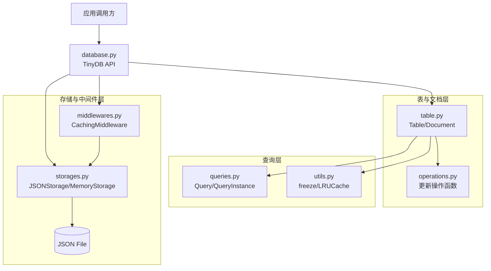

```mermaid
graph TB
    caller["应用调用方"] --> dbapi["database.py\nTinyDB API"]

    subgraph table_layer["表与文档层"]
      table["table.py\nTable/Document"]
      ops["operations.py\n更新操作函数"]
    end

    subgraph query_layer["查询层"]
      query["queries.py\nQuery/QueryInstance"]
      utils["utils.py\nfreeze/LRUCache"]
    end

    subgraph storage_layer["存储与中间件层"]
      storages["storages.py\nJSONStorage/MemoryStorage"]
      middleware["middlewares.py\nCachingMiddleware"]
      jsonfile[("JSON File")]
    end

    dbapi --> table
    table --> query
    table --> ops
    table --> utils

    dbapi --> storages
    dbapi --> middleware
    middleware --> storages
    storages --> jsonfile
```